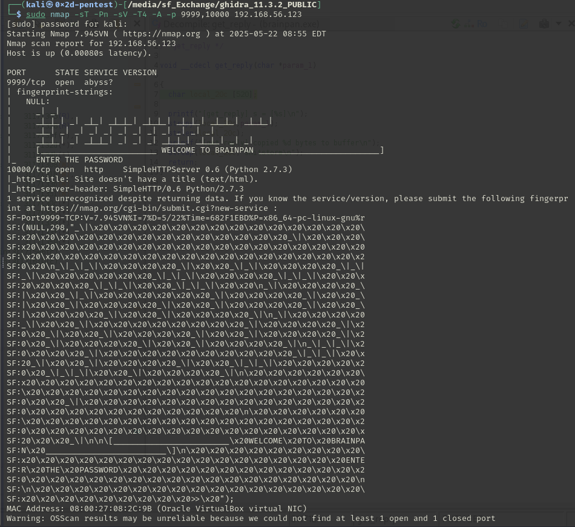

# VulnHub - 41-Brainpan

📅 Дата: 2025-05-22  
🧠 Сложность:  
💻 IP-адрес: 192.168.56.123  

---

## 🔍 Сканирование

```bash
export ip=192.168.56.123
export ports=9999,10000
sudo nmap -sT -Pn -sV -T4 -A -p $ports $ip -oN scans/nmap.txt
```

🖼️ Nmap скан:



---

## 🕵️ Enumeration
```bash
┌──(kali㉿0x2d-pentest)-[~/Labs/VulnHub]
└─$ ffuf -fc 404 -t 100 -u http://$ip:10000/FUZZ -w /media/sf_Exchange/Dictionaries/Dir/directory-list-2.3-medium.txt
bin                     [Status: 301, Size: 0, Words: 1, Lines: 1, Duration: 18ms]
```


Загружаю в Ghidra


Вижу переменные отказа и разрешения доступа:
```bash
  local_404 = "                          ACCESS DENIED\n";
  local_408 = "                          ACCESS GRANTED\n";
```
В переменную **char local_3fc [1016];** считывается пользовательский ввод (1000 байт) -> затирание данных можно не рассматривать

Функция **get_reply(local_3fc)** осуществляет какую-то проверку и возвращает **0**, если она успешна.

Иду в функцию **get_reply()**:


Получение доступа ничего не дало:


Так что смотрю переполнение буфера: 1000 байт записываются в переменную 520 байт

Стек имеет такой вид:
```bash
[EBP - 0x20C] local_20c      (520 байт)
[EBP - 0x218] local_218      (4 байта)
[EBP - 0x21C] local_21c      (4 байта)
[EBP + 0x00] saved EBP       (4 байта)
[EBP + 0x04] return address  (4 байта)
```

Нужно записать 200*NOP + payload + 


## 📂 Получение доступа


## ⚙️ Привилегии


## 🏁 Флаги

- User flag: 
- Root flag: 

---

## 📋 Резюме

🧰 **Инструменты:**
  - nmap, ffuf, и др.

🚨 **Уязвимости, которые удалось обнаружить:**  
  - Directory Traversal  
  - RCE через уязвимый скрипт  

🛡 **Советы по защите:**
  - Использовать сложные пароли и ограничить число попыток входа
  - Обновлять ПО до актуальных версий
  - Удалять/ограничивать использование SUID-бинарников
  - Настроить логирование и мониторинг системных событий
  - Применять принцип наименьших привилегий


