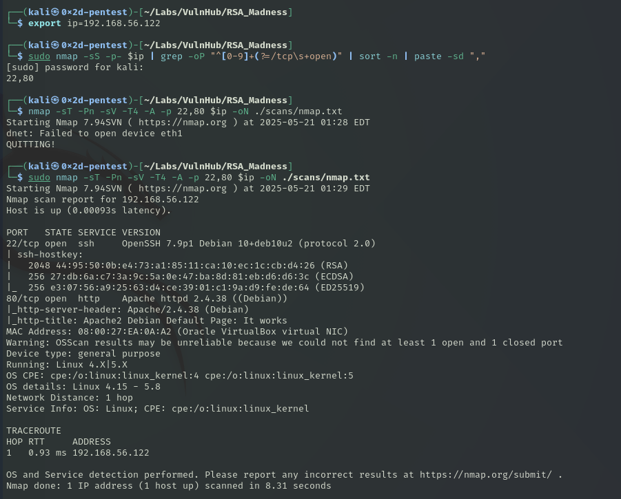

# RSA_Madness

📅 Дата: 2025-05-21  
🧠 Сложность:  easy
💻 IP-адрес:  192.168.56.122

---

## 🔍 Сканирование

```bash
export ip=192.168.56.122
sudo nmap -sS -p- $ip | grep -oP "^[0-9]+(?=/tcp\s+open)" | sort -n | paste -sd ","
sudo nmap -sT -Pn -sV -T4 -A -p 22,80 $ip -oN scans/nmap.txt
```

🖼️ Nmap скан:



---

## 📂 Получение доступа


## ⚙️ Привилегии


## 🏁 Флаги

- User flag: 
- Root flag: 

---

## 🧠 Что я узнал?


